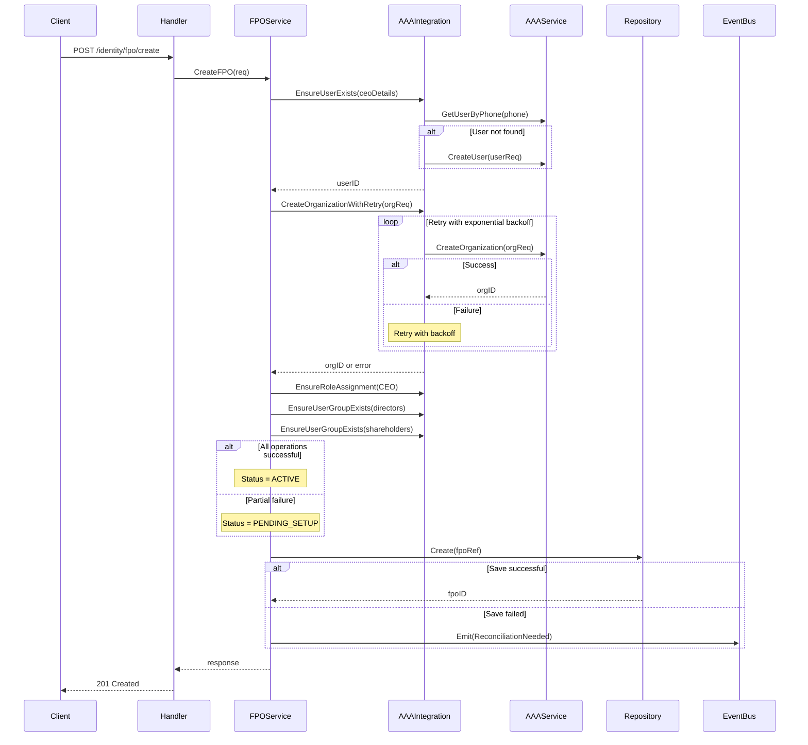

# ADR-002: FPO Registration and AAA Service Integration Architecture

**Status:** Proposed
**Date:** 2025-11-17
**Deciders:** Backend Architecture Team, Security Team, Operations Team
**Context Owner:** @agent-sde3-backend-architect

---

## Executive Summary

This ADR defines the architecture for integrating FPO (Farmer Producer Organization) creation in the farmers-module with organization creation in the AAA (Authentication, Authorization, Auditing) service. The solution addresses transaction boundaries, failure handling, rollback strategies, and ensures system reliability while maintaining data consistency between distributed services.

---

## Context and Problem Statement

When creating an FPO via the farmers-module API (`/api/v1/identity/fpo/create`), we need to:
1. Create a local FPO record in farmers-module database
2. Create a corresponding organization in AAA service via gRPC
3. Create CEO user and assign appropriate roles
4. Setup user groups with permissions for organizational hierarchy

**Core Challenge:** How do we maintain consistency between farmers-module and AAA service in a distributed system where either service can fail independently?

**Current Implementation Issues:**
- FPO creation currently only creates local records without full AAA integration
- No clear transaction boundaries between local and remote operations
- Insufficient error recovery mechanisms for partial failures
- Missing idempotency guarantees for retry operations

---

## Decision Drivers

1. **Data Consistency**: Prevent orphaned records in either system
2. **System Availability**: Service should remain operational despite AAA transient failures
3. **Recovery Capability**: Support graceful recovery from partial failures
4. **Operational Simplicity**: Clear debugging and monitoring capabilities
5. **Performance**: Minimize latency impact from distributed operations
6. **Security**: Ensure proper authorization setup even during failures
7. **Audit Requirements**: Full traceability of all operations

---

## Considered Options

### Option 1: Synchronous Two-Phase Commit (2PC)

**Pattern:**
```go
// Phase 1: Prepare
aaaOrgID := prepareAAAOrganization(ctx, req)
localFPOID := prepareFPORecord(ctx, req)

// Phase 2: Commit
commitAAA(ctx, aaaOrgID)
commitLocal(ctx, localFPOID)
```

**Pros:**
- Strong consistency guarantees
- ACID transaction properties

**Cons:**
- Complex distributed transaction coordinator required
- High latency (multiple round trips)
- AAA service doesn't support 2PC protocol
- Blocking operations reduce availability

**Decision:** REJECTED - Infrastructure complexity exceeds benefits

---

### Option 2: Synchronous Sequential with Compensating Transactions

**Pattern:**
```go
func CreateFPO(ctx context.Context, req) (*Response, error) {
    // Step 1: Create in AAA first (source of truth)
    aaaOrg, err := aaaClient.CreateOrganization(ctx, req)
    if err != nil {
        return nil, err // Nothing to rollback
    }

    // Step 2: Create local record
    fpoRef, err := fpoRepo.Create(ctx, mapToFPORef(aaaOrg))
    if err != nil {
        // Compensate: Delete from AAA
        aaaClient.DeleteOrganization(ctx, aaaOrg.ID)
        return nil, err
    }

    return response, nil
}
```

**Pros:**
- Simple mental model
- Clear rollback path
- Maintains consistency

**Cons:**
- AAA service doesn't support organization deletion (security constraint)
- Compensation can fail, leaving inconsistent state
- Increased latency from sequential operations

**Decision:** REJECTED - Lack of deletion API makes compensation impossible

---

### Option 3: Event-Driven Eventual Consistency (Selected) ✓

**Pattern:**
```go
func CreateFPO(ctx context.Context, req) (*Response, error) {
    // Step 1: Create in AAA (authoritative source)
    aaaResp, err := createAAAOrganizationWithRetry(ctx, req)
    if err != nil {
        return nil, fmt.Errorf("failed to create AAA organization: %w", err)
    }

    // Step 2: Create local reference with status tracking
    fpoRef := &FPORef{
        AAAOrgID: aaaResp.OrgID,
        Status:   determineFPOStatus(aaaResp),
        SetupErrors: captureSetupErrors(aaaResp),
    }

    // Step 3: Best-effort local save (non-fatal)
    if err := fpoRepo.Create(ctx, fpoRef); err != nil {
        // Log but don't fail - AAA org exists
        logger.Error("Failed to save FPO reference locally",
            zap.String("aaa_org_id", aaaResp.OrgID),
            zap.Error(err))
        // Emit reconciliation event
        eventBus.Emit(FPOLocalSaveFailed{OrgID: aaaResp.OrgID})
    }

    return &CreateFPOResponse{
        AAAOrgID: aaaResp.OrgID,
        Status: fpoRef.Status,
    }, nil
}
```

**Pros:**
- AAA service as single source of truth
- Graceful degradation on partial failures
- Support for async reconciliation
- Clear status tracking (ACTIVE, PENDING_SETUP)
- No blocking operations

**Cons:**
- Eventual consistency window
- Requires reconciliation mechanism
- More complex monitoring

**Decision:** ACCEPTED - Best balance of availability, consistency, and operational simplicity

---

## Architecture Design

### 1. Component Architecture

```
┌─────────────────────────────────────────────────────────────────┐
│                         API Gateway                             │
└─────────────────────────────────────────────────────────────────┘
                                │
                                ▼
┌─────────────────────────────────────────────────────────────────┐
│                      FPO Handler Layer                          │
│  - Request validation                                           │
│  - Response formatting                                          │
│  - Error mapping                                               │
└─────────────────────────────────────────────────────────────────┘
                                │
                                ▼
┌─────────────────────────────────────────────────────────────────┐
│                    FPO Service Layer                            │
│  - Business logic orchestration                                 │
│  - Transaction coordination                                     │
│  - Status determination                                         │
└─────────────────────────────────────────────────────────────────┘
                    │                           │
                    ▼                           ▼
┌──────────────────────────────┐  ┌──────────────────────────────┐
│   AAA Integration Service    │  │    FPO Repository Layer      │
│  - gRPC client wrapper        │  │  - Local persistence         │
│  - Retry logic               │  │  - Status tracking           │
│  - Circuit breaker           │  │  - Query operations          │
└──────────────────────────────┘  └──────────────────────────────┘
                    │                           │
                    ▼                           ▼
┌──────────────────────────────┐  ┌──────────────────────────────┐
│      AAA Service (gRPC)      │  │      PostgreSQL DB           │
│  - Organization management    │  │  - fpo_refs table            │
│  - User management           │  │  - farmer_links table        │
│  - Role/permission mgmt      │  │  - audit_logs table          │
└──────────────────────────────┘  └──────────────────────────────┘
```

### 2. Service Interfaces

```go
// Enhanced FPOService interface
type FPOService interface {
    // Core operations
    CreateFPO(ctx context.Context, req *CreateFPORequest) (*CreateFPOResponse, error)
    RegisterFPORef(ctx context.Context, req *RegisterFPORefRequest) (*FPORefResponse, error)
    GetFPORef(ctx context.Context, orgID string) (*FPORefResponse, error)

    // Recovery operations
    CompleteFPOSetup(ctx context.Context, orgID string) (*FPORefResponse, error)
    ReconcileFPOStatus(ctx context.Context, orgID string) error
}

// New AAA Integration Service
type AAAIntegrationService interface {
    // Organization operations with built-in retry
    CreateOrganizationWithRetry(ctx context.Context, req *OrgRequest) (*OrgResponse, error)

    // Idempotent operations
    EnsureUserExists(ctx context.Context, req *UserRequest) (string, error)
    EnsureUserGroupExists(ctx context.Context, req *GroupRequest) (string, error)
    EnsureRoleAssignment(ctx context.Context, userID, orgID, role string) error

    // Health and status
    CheckOrganizationHealth(ctx context.Context, orgID string) (*OrgHealth, error)
}
```

### 3. Transaction Flow



### 4. Data Models

```go
// Enhanced FPORef entity
type FPORef struct {
    base.BaseModel

    // Core fields
    AAAOrgID       string    `gorm:"unique;not null;index"`
    Name           string    `gorm:"not null"`
    RegistrationNo string    `gorm:"index"`

    // Status tracking
    Status         FPOStatus `gorm:"type:varchar(50);default:'ACTIVE'"`
    SetupErrors    JSONB     `gorm:"type:jsonb"` // Track partial failures

    // Business configuration
    BusinessConfig JSONB     `gorm:"type:jsonb;default:'{}'"`

    // Reconciliation tracking
    LastSyncAt     *time.Time `gorm:"index"`
    SyncVersion    int        `gorm:"default:0"`

    // Audit fields (from BaseModel)
    CreatedAt      time.Time
    UpdatedAt      time.Time
    DeletedAt      *time.Time
}

// FPO Status enum
type FPOStatus string

const (
    FPOStatusActive       FPOStatus = "ACTIVE"        // Fully setup
    FPOStatusPendingSetup FPOStatus = "PENDING_SETUP" // Partial setup
    FPOStatusInactive     FPOStatus = "INACTIVE"      // Deactivated
    FPOStatusSuspended    FPOStatus = "SUSPENDED"     // Temporarily suspended
)

// Setup error tracking
type SetupError struct {
    Component   string    `json:"component"`
    Error       string    `json:"error"`
    Timestamp   time.Time `json:"timestamp"`
    Retryable   bool      `json:"retryable"`
    RetryCount  int       `json:"retry_count"`
}
```

### 5. Error Handling Strategy

```go
// Retry configuration
type RetryConfig struct {
    MaxAttempts     int           // 3
    InitialDelay    time.Duration // 1s
    MaxDelay        time.Duration // 30s
    BackoffFactor   float64       // 2.0
    JitterFraction  float64       // 0.1
}

// Circuit breaker configuration
type CircuitBreakerConfig struct {
    FailureThreshold   int           // 5 consecutive failures
    SuccessThreshold   int           // 2 consecutive successes
    Timeout           time.Duration  // 60s
    HalfOpenRequests  int           // 3
}

// Error categories
type ErrorCategory int

const (
    ErrorCategoryTransient  ErrorCategory = iota // Retry
    ErrorCategoryBusiness                        // Don't retry
    ErrorCategoryValidation                      // Don't retry
    ErrorCategoryFatal                          // Circuit break
)

// Enhanced error handling
func (s *AAAIntegrationService) CreateOrganizationWithRetry(
    ctx context.Context,
    req *OrgRequest,
) (*OrgResponse, error) {
    return retry.DoWithData(
        func() (*OrgResponse, error) {
            resp, err := s.client.CreateOrganization(ctx, req)
            if err != nil {
                if category := categorizeError(err); category == ErrorCategoryBusiness {
                    return nil, retry.Unrecoverable(err)
                }
                return nil, err
            }
            return resp, nil
        },
        retry.Attempts(s.config.MaxAttempts),
        retry.Delay(s.config.InitialDelay),
        retry.MaxDelay(s.config.MaxDelay),
        retry.DelayType(retry.BackOffDelay),
        retry.OnRetry(func(n uint, err error) {
            s.logger.Warn("Retrying AAA organization creation",
                zap.Uint("attempt", n),
                zap.Error(err))
            s.metrics.IncrRetry("create_organization")
        }),
    )
}
```

### 6. Idempotency Design

```go
// Idempotent organization creation
func (s *AAAIntegrationService) EnsureOrganizationExists(
    ctx context.Context,
    req *OrgRequest,
) (string, error) {
    // Generate deterministic ID from request
    idempotencyKey := generateIdempotencyKey(req)

    // Check cache first
    if orgID, found := s.cache.Get(idempotencyKey); found {
        return orgID, nil
    }

    // Try to find existing organization
    existing, err := s.client.GetOrganizationByName(ctx, req.Name)
    if err == nil && existing != nil {
        s.cache.Set(idempotencyKey, existing.ID, 5*time.Minute)
        return existing.ID, nil
    }

    // Create new organization
    resp, err := s.CreateOrganizationWithRetry(ctx, req)
    if err != nil {
        // Check if it's a duplicate error
        if isDuplicateError(err) {
            // Race condition - fetch again
            existing, err = s.client.GetOrganizationByName(ctx, req.Name)
            if err == nil && existing != nil {
                s.cache.Set(idempotencyKey, existing.ID, 5*time.Minute)
                return existing.ID, nil
            }
        }
        return "", err
    }

    s.cache.Set(idempotencyKey, resp.OrgID, 5*time.Minute)
    return resp.OrgID, nil
}

// Idempotency key generation
func generateIdempotencyKey(req *OrgRequest) string {
    h := sha256.New()
    h.Write([]byte(req.Name))
    h.Write([]byte(req.RegistrationNo))
    h.Write([]byte(req.Type))
    return fmt.Sprintf("org:%x", h.Sum(nil)[:16])
}
```

### 7. Reconciliation Service

```go
// Reconciliation service for handling inconsistencies
type ReconciliationService struct {
    fpoRepo       FPORepository
    aaaClient     AAAClient
    logger        Logger
    metrics       MetricsCollector
}

// Reconcile FPO status with AAA
func (r *ReconciliationService) ReconcileFPOStatus(
    ctx context.Context,
    orgID string,
) error {
    // Get local FPO reference
    fpoRef, err := r.fpoRepo.FindByAAAOrgID(ctx, orgID)
    if err != nil {
        if errors.Is(err, ErrNotFound) {
            // FPO exists in AAA but not locally
            return r.createMissingFPORef(ctx, orgID)
        }
        return err
    }

    // Get AAA organization status
    aaaOrg, err := r.aaaClient.GetOrganization(ctx, orgID)
    if err != nil {
        if errors.Is(err, ErrNotFound) {
            // FPO exists locally but not in AAA
            return r.handleOrphanedFPORef(ctx, fpoRef)
        }
        return err
    }

    // Check setup completion
    if fpoRef.Status == FPOStatusPendingSetup {
        return r.completeSetup(ctx, fpoRef, aaaOrg)
    }

    // Sync status
    return r.syncStatus(ctx, fpoRef, aaaOrg)
}

// Scheduled reconciliation job
func (r *ReconciliationService) RunPeriodicReconciliation(ctx context.Context) {
    ticker := time.NewTicker(15 * time.Minute)
    defer ticker.Stop()

    for {
        select {
        case <-ticker.C:
            r.reconcileAll(ctx)
        case <-ctx.Done():
            return
        }
    }
}
```

### 8. Monitoring and Observability

```go
// Metrics to track
type FPOMetrics struct {
    // Counters
    FPOCreationTotal        Counter
    FPOCreationSuccess      Counter
    FPOCreationFailure      Counter
    AAAOrgCreationRetries   Counter
    ReconciliationRuns      Counter

    // Histograms
    FPOCreationDuration     Histogram
    AAACallDuration         Histogram
    ReconciliationDuration  Histogram

    // Gauges
    PendingSetupFPOs        Gauge
    OrphanedFPOs           Gauge
    CircuitBreakerStatus    Gauge
}

// Structured logging
func (s *FPOService) CreateFPO(ctx context.Context, req *CreateFPORequest) (*CreateFPOResponse, error) {
    start := time.Now()
    logger := s.logger.With(
        zap.String("request_id", req.RequestID),
        zap.String("fpo_name", req.Name),
        zap.String("registration_number", req.RegistrationNo),
    )

    defer func() {
        s.metrics.FPOCreationDuration.Observe(time.Since(start).Seconds())
    }()

    // ... implementation ...

    logger.Info("FPO creation completed",
        zap.String("aaa_org_id", resp.AAAOrgID),
        zap.String("status", resp.Status),
        zap.Duration("duration", time.Since(start)),
    )
}

// Health checks
type HealthCheck struct {
    AAAServiceReachable     bool
    DatabaseConnected       bool
    ReconciliationActive    bool
    CircuitBreakerOpen      bool
    PendingSetupCount       int
}
```

---

## Implementation Guidelines

### Phase 1: Core Integration (Week 1-2)
1. Implement enhanced `AAAIntegrationService` with retry logic
2. Add idempotency support to AAA client operations
3. Update `FPORef` model with status tracking
4. Implement basic `CreateFPO` with AAA integration

### Phase 2: Resilience (Week 2-3)
1. Add circuit breaker to AAA client
2. Implement reconciliation service
3. Add monitoring and metrics
4. Setup alerting for failures

### Phase 3: Recovery (Week 3-4)
1. Implement `CompleteFPOSetup` endpoint
2. Add scheduled reconciliation job
3. Create admin tools for manual recovery
4. Document operational procedures

### Phase 4: Testing (Week 4-5)
1. Unit tests with mocked AAA service
2. Integration tests with test AAA instance
3. Chaos engineering tests
4. Load testing for retry/circuit breaker

---

## Testing Strategy

### Unit Tests
```go
func TestCreateFPO_Success(t *testing.T) {
    // Given
    mockAAA := NewMockAAAClient()
    mockAAA.On("CreateOrganization", mock.Anything, mock.Anything).
        Return(&OrgResponse{OrgID: "org-123"}, nil)

    service := NewFPOService(mockAAA, mockRepo)

    // When
    resp, err := service.CreateFPO(ctx, &CreateFPORequest{
        Name: "Test FPO",
        RegistrationNo: "REG123",
    })

    // Then
    assert.NoError(t, err)
    assert.Equal(t, "org-123", resp.AAAOrgID)
    assert.Equal(t, "ACTIVE", resp.Status)
}

func TestCreateFPO_PartialFailure(t *testing.T) {
    // Test PENDING_SETUP status on partial failure
}

func TestCreateFPO_Idempotency(t *testing.T) {
    // Test duplicate requests return same result
}
```

### Integration Tests
```go
func TestFPOCreation_EndToEnd(t *testing.T) {
    // Test full flow with real AAA service
}

func TestReconciliation_HealsInconsistencies(t *testing.T) {
    // Test reconciliation service
}
```

### Chaos Tests
```go
func TestFPOCreation_NetworkPartition(t *testing.T) {
    // Simulate network failures
}

func TestFPOCreation_AAATimeout(t *testing.T) {
    // Simulate AAA service timeouts
}
```

---

## Security Considerations

1. **Authentication**: All AAA calls must include service-to-service authentication
2. **Authorization**: Verify caller has permission to create FPOs
3. **Audit Logging**: Log all operations with request ID for traceability
4. **Secret Management**: Store AAA credentials in secure vault
5. **Rate Limiting**: Implement rate limits to prevent abuse
6. **Data Encryption**: Use TLS for gRPC communication

---

## Operational Considerations

### Monitoring Alerts
```yaml
alerts:
  - name: FPOCreationFailureRate
    condition: rate(fpo_creation_failure) > 0.1
    severity: warning

  - name: PendingSetupFPOsHigh
    condition: pending_setup_fpos > 10
    severity: warning

  - name: AAAServiceUnreachable
    condition: aaa_service_reachable == 0
    severity: critical

  - name: ReconciliationFailing
    condition: rate(reconciliation_errors) > 0
    severity: warning
```

### Runbooks
1. **High Failure Rate**: Check AAA service health, review recent changes
2. **Many Pending FPOs**: Run manual reconciliation, check setup errors
3. **AAA Unreachable**: Verify network, check AAA deployment status
4. **Reconciliation Failing**: Check error logs, verify data consistency

---

## Migration Strategy

For existing FPOs without AAA organizations:
1. Create batch migration tool
2. Generate AAA organizations for existing FPOs
3. Update local records with AAA org IDs
4. Verify all linkages are correct
5. Enable new flow after migration complete

---

## Consequences

### Positive
- Clear separation of concerns between services
- Graceful handling of partial failures
- Support for recovery from any state
- Comprehensive observability
- Maintains high availability

### Negative
- Eventual consistency window (typically < 1 minute)
- Additional complexity in reconciliation logic
- Requires monitoring and operational procedures
- Higher operational overhead

### Risks and Mitigations
| Risk | Impact | Mitigation |
|------|--------|------------|
| AAA service downtime | FPO creation blocked | Circuit breaker + queue for retry |
| Reconciliation failures | Data inconsistency | Manual recovery tools + alerts |
| Duplicate organizations | Resource waste | Idempotency checks |
| Performance degradation | Poor user experience | Caching + async operations |

---

## Decision

We will implement **Option 3: Event-Driven Eventual Consistency** with the following key components:

1. AAA service as authoritative source for organizations
2. Synchronous creation with best-effort local save
3. Status tracking (ACTIVE/PENDING_SETUP) for partial failures
4. Reconciliation service for healing inconsistencies
5. Comprehensive monitoring and alerting
6. Idempotent operations throughout

This approach provides the best balance of consistency, availability, and operational simplicity while supporting graceful degradation and recovery.

---

## References

- [ADR-001: Role Assignment Strategy](./adr-role-assignment-strategy.md)
- [Microservices Pattern: Saga](https://microservices.io/patterns/data/saga.html)
- [Circuit Breaker Pattern](https://martinfowler.com/bliki/CircuitBreaker.html)
- [Idempotency in Distributed Systems](https://aws.amazon.com/builders-library/making-retries-safe-with-idempotent-APIs/)

---

## Appendix A: Sample Implementation

```go
// Complete FPO creation implementation
func (s *FPOServiceImpl) CreateFPO(ctx context.Context, req *CreateFPORequest) (*CreateFPOResponse, error) {
    logger := s.logger.With(
        zap.String("request_id", req.RequestID),
        zap.String("fpo_name", req.Name),
    )

    // Step 1: Ensure CEO user exists
    ceoUserID, err := s.aaaIntegration.EnsureUserExists(ctx, &UserRequest{
        PhoneNumber: req.CEOUser.PhoneNumber,
        FirstName:   req.CEOUser.FirstName,
        LastName:    req.CEOUser.LastName,
        Email:       req.CEOUser.Email,
        Password:    req.CEOUser.Password,
    })
    if err != nil {
        logger.Error("Failed to ensure CEO user exists", zap.Error(err))
        return nil, fmt.Errorf("CEO user creation failed: %w", err)
    }

    // Step 2: Create organization in AAA
    orgResp, err := s.aaaIntegration.CreateOrganizationWithRetry(ctx, &OrgRequest{
        Name:        req.Name,
        Type:        "FPO",
        Description: req.Description,
        CEOUserID:   ceoUserID,
        Metadata:    req.Metadata,
    })
    if err != nil {
        logger.Error("Failed to create AAA organization", zap.Error(err))
        return nil, fmt.Errorf("organization creation failed: %w", err)
    }

    logger.Info("AAA organization created", zap.String("aaa_org_id", orgResp.OrgID))

    // Step 3: Setup roles and groups (best-effort)
    setupErrors := make(map[string]string)

    // Assign CEO role
    if err := s.aaaIntegration.EnsureRoleAssignment(ctx, ceoUserID, orgResp.OrgID, "CEO"); err != nil {
        logger.Warn("Failed to assign CEO role", zap.Error(err))
        setupErrors["ceo_role"] = err.Error()
    }

    // Create user groups
    groups := []string{"directors", "shareholders", "store_staff", "store_managers"}
    createdGroups := []UserGroupData{}

    for _, groupName := range groups {
        groupID, err := s.aaaIntegration.EnsureUserGroupExists(ctx, &GroupRequest{
            Name:        groupName,
            OrgID:       orgResp.OrgID,
            Description: fmt.Sprintf("%s group for %s", groupName, req.Name),
            Permissions: s.getGroupPermissions(groupName),
        })
        if err != nil {
            logger.Warn("Failed to create user group",
                zap.String("group", groupName),
                zap.Error(err))
            setupErrors[fmt.Sprintf("group_%s", groupName)] = err.Error()
            continue
        }

        createdGroups = append(createdGroups, UserGroupData{
            GroupID: groupID,
            Name:    groupName,
            OrgID:   orgResp.OrgID,
        })
    }

    // Step 4: Determine status
    status := FPOStatusActive
    if len(setupErrors) > 0 {
        status = FPOStatusPendingSetup
        logger.Warn("FPO created with incomplete setup",
            zap.Any("setup_errors", setupErrors))
    }

    // Step 5: Create local reference
    fpoRef := &FPORef{
        AAAOrgID:       orgResp.OrgID,
        Name:           req.Name,
        RegistrationNo: req.RegistrationNo,
        Status:         status,
        BusinessConfig: req.BusinessConfig,
        SetupErrors:    setupErrors,
    }

    if err := s.fpoRepo.Create(ctx, fpoRef); err != nil {
        logger.Error("Failed to save FPO reference locally",
            zap.String("aaa_org_id", orgResp.OrgID),
            zap.Error(err))

        // Emit reconciliation event
        s.eventBus.Emit(ctx, &ReconciliationNeededEvent{
            Type:     "fpo_local_save_failed",
            AAAOrgID: orgResp.OrgID,
            Data:     fpoRef,
        })

        // Don't fail - AAA org exists
        fpoRef.ID = "" // No local ID yet
    }

    // Step 6: Emit success event
    s.eventBus.Emit(ctx, &FPOCreatedEvent{
        FPOID:      fpoRef.ID,
        AAAOrgID:   orgResp.OrgID,
        Name:       req.Name,
        Status:     status.String(),
        CEOUserID:  ceoUserID,
        UserGroups: createdGroups,
    })

    // Return response
    return &CreateFPOResponse{
        FPOID:      fpoRef.ID,
        AAAOrgID:   orgResp.OrgID,
        Name:       req.Name,
        Status:     status.String(),
        CEOUserID:  ceoUserID,
        UserGroups: createdGroups,
        CreatedAt:  time.Now(),
    }, nil
}
```
