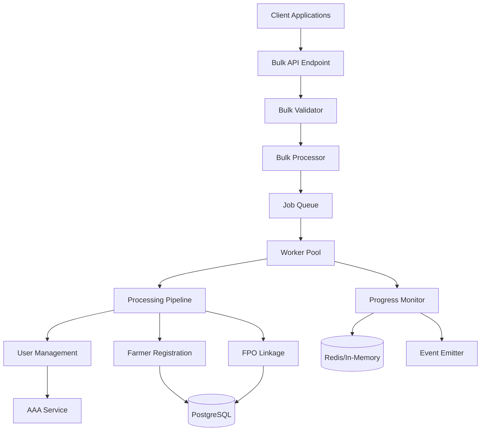
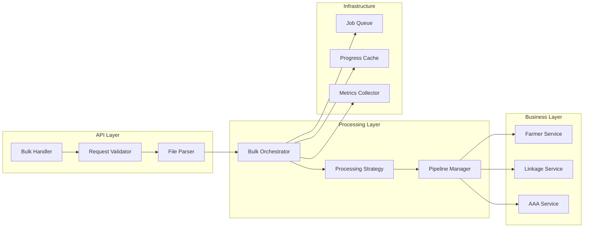
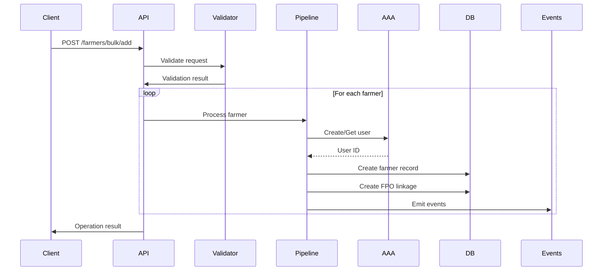
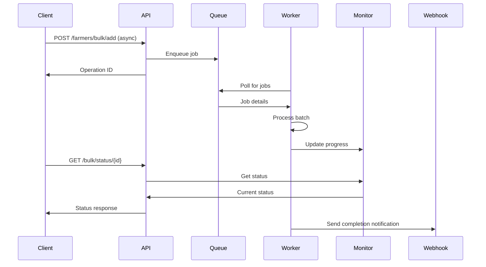

# Bulk Farmer Operations Design Document

## Executive Summary

This document outlines the design for implementing bulk farmer addition functionality to FPOs (Farmer Producer Organizations). The design follows SDE 3 principles focusing on modularity, extensibility, performance, and maintainability while integrating seamlessly with the existing farmers-module architecture.

## Problem Statement

Current system limitations:
- Only supports individual farmer registration and linking
- No efficient mechanism for onboarding multiple farmers simultaneously
- Manual process for FPOs with large farmer bases
- Lack of batch processing capabilities for farmer-FPO associations

Business requirements:
- FPOs need to onboard hundreds or thousands of farmers efficiently
- Support for CSV/Excel uploads for bulk farmer data
- Validation and error handling for bulk operations
- Progress tracking and reporting for bulk operations
- Rollback capabilities for failed bulk operations

## Architecture Overview

### High-Level Design



### Component Architecture



## Detailed Design

### 1. Data Models

#### Bulk Operation Request
```go
type BulkFarmerAdditionRequest struct {
    BaseRequest
    FPOOrgID        string                 `json:"fpo_org_id" validate:"required"`
    InputFormat     string                 `json:"input_format" validate:"required,oneof=csv excel json"`
    Data            []byte                 `json:"data,omitempty"`          // For direct data upload
    FileURL         string                 `json:"file_url,omitempty"`      // For file URL reference
    ProcessingMode  string                 `json:"processing_mode" validate:"required,oneof=sync async batch"`
    Options         BulkProcessingOptions  `json:"options"`
}

type BulkProcessingOptions struct {
    ValidateOnly        bool              `json:"validate_only"`        // Dry run mode
    ContinueOnError     bool              `json:"continue_on_error"`     // Continue processing on individual failures
    ChunkSize           int               `json:"chunk_size"`            // Size of processing chunks (default: 100)
    MaxConcurrency      int               `json:"max_concurrency"`       // Max parallel workers (default: 10)
    DeduplicationMode   string            `json:"deduplication_mode"`   // How to handle duplicates: skip, update, error
    NotificationWebhook string            `json:"notification_webhook"`  // Webhook for completion notification
    AssignKisanSathi    bool              `json:"assign_kisan_sathi"`    // Auto-assign KisanSathi if available
    KisanSathiUserID    *string           `json:"kisan_sathi_user_id"`   // Specific KisanSathi to assign
    Metadata            map[string]string `json:"metadata"`              // Additional metadata
}

type FarmerBulkData struct {
    FirstName         string            `json:"first_name" validate:"required"`
    LastName          string            `json:"last_name" validate:"required"`
    PhoneNumber       string            `json:"phone_number" validate:"required,phone"`
    Email             string            `json:"email" validate:"omitempty,email"`
    DateOfBirth       string            `json:"date_of_birth"`
    Gender            string            `json:"gender" validate:"omitempty,oneof=male female other"`
    Address           AddressData       `json:"address"`
    LandOwnershipType string            `json:"land_ownership_type"`
    CustomFields      map[string]string `json:"custom_fields"`
    ExternalID        string            `json:"external_id"` // For tracking and idempotency
}
```

#### Bulk Operation Status
```go
type BulkOperationStatus struct {
    BaseModel
    OperationID       string                  `json:"operation_id"`
    FPOOrgID          string                  `json:"fpo_org_id"`
    Status            string                  `json:"status"` // pending, processing, completed, failed, cancelled
    TotalRecords      int                     `json:"total_records"`
    ProcessedRecords  int                     `json:"processed_records"`
    SuccessfulRecords int                     `json:"successful_records"`
    FailedRecords     int                     `json:"failed_records"`
    SkippedRecords    int                     `json:"skipped_records"`
    StartTime         *time.Time              `json:"start_time"`
    EndTime           *time.Time              `json:"end_time"`
    ProcessingDetails []ProcessingDetail      `json:"processing_details"`
    ErrorSummary      map[string]int          `json:"error_summary"`      // Error type to count mapping
    ResultFileURL     string                  `json:"result_file_url"`     // URL to download results
    Metadata          map[string]interface{}  `json:"metadata"`
}

type ProcessingDetail struct {
    RecordIndex    int                    `json:"record_index"`
    ExternalID     string                 `json:"external_id"`
    Status         string                 `json:"status"` // success, failed, skipped
    FarmerID       *string                `json:"farmer_id,omitempty"`
    AAAUserID      *string                `json:"aaa_user_id,omitempty"`
    Error          *string                `json:"error,omitempty"`
    ProcessedAt    time.Time              `json:"processed_at"`
    ProcessingTime time.Duration          `json:"processing_time"`
}
```

### 2. Service Layer Design

#### Bulk Farmer Service Interface
```go
type BulkFarmerService interface {
    // Core bulk operations
    BulkAddFarmersToFPO(ctx context.Context, req *BulkFarmerAdditionRequest) (*BulkOperationStatus, error)
    GetBulkOperationStatus(ctx context.Context, operationID string) (*BulkOperationStatus, error)
    CancelBulkOperation(ctx context.Context, operationID string) error
    RetryFailedRecords(ctx context.Context, operationID string) (*BulkOperationStatus, error)

    // File operations
    ValidateBulkFile(ctx context.Context, format string, data []byte) (*ValidationResult, error)
    ParseBulkFile(ctx context.Context, format string, data []byte) ([]*FarmerBulkData, error)
    GenerateResultFile(ctx context.Context, operationID string) ([]byte, error)

    // Template operations
    GetBulkUploadTemplate(ctx context.Context, format string) ([]byte, error)
    ValidateBulkData(ctx context.Context, farmers []*FarmerBulkData) (*ValidationResult, error)
}

type ValidationResult struct {
    IsValid      bool                   `json:"is_valid"`
    TotalRecords int                    `json:"total_records"`
    ValidRecords int                    `json:"valid_records"`
    Errors       []ValidationError      `json:"errors"`
    Warnings     []ValidationWarning    `json:"warnings"`
    Summary      map[string]interface{} `json:"summary"`
}
```

#### Processing Strategy Pattern
```go
// Strategy interface for different processing modes
type ProcessingStrategy interface {
    Process(ctx context.Context, req *BulkFarmerAdditionRequest, data []*FarmerBulkData) (*BulkOperationStatus, error)
    GetName() string
    SupportsAsync() bool
}

// Concrete strategies
type SynchronousStrategy struct {
    farmerService  FarmerService
    linkageService FarmerLinkageService
    aaaService     AAAService
    logger         Logger
}

type AsynchronousStrategy struct {
    queueService   QueueService
    monitorService MonitorService
    logger         Logger
}

type BatchStrategy struct {
    batchProcessor BatchProcessor
    chunkSize      int
    maxWorkers     int
    logger         Logger
}
```

#### Pipeline Pattern for Processing
```go
type ProcessingPipeline interface {
    AddStage(stage PipelineStage) ProcessingPipeline
    Execute(ctx context.Context, data interface{}) (interface{}, error)
}

type PipelineStage interface {
    Process(ctx context.Context, data interface{}) (interface{}, error)
    GetName() string
    CanRetry() bool
}

// Concrete stages
type ValidationStage struct{}
type DeduplicationStage struct{}
type AAAUserCreationStage struct{}
type FarmerRegistrationStage struct{}
type FPOLinkageStage struct{}
type KisanSathiAssignmentStage struct{}
type NotificationStage struct{}
```

### 3. Processing Workflows

#### Synchronous Processing Flow


#### Asynchronous Processing Flow


### 4. Error Handling and Recovery

#### Error Classification
```go
type BulkErrorType string

const (
    ErrorTypeValidation      BulkErrorType = "VALIDATION"
    ErrorTypeDuplication     BulkErrorType = "DUPLICATION"
    ErrorTypeAAA             BulkErrorType = "AAA_SERVICE"
    ErrorTypeDatabase        BulkErrorType = "DATABASE"
    ErrorTypeRateLimit       BulkErrorType = "RATE_LIMIT"
    ErrorTypeNetwork         BulkErrorType = "NETWORK"
    ErrorTypePermission      BulkErrorType = "PERMISSION"
    ErrorTypeDataIntegrity   BulkErrorType = "DATA_INTEGRITY"
)

type BulkProcessingError struct {
    Type        BulkErrorType          `json:"type"`
    Code        string                 `json:"code"`
    Message     string                 `json:"message"`
    RecordIndex int                    `json:"record_index"`
    ExternalID  string                 `json:"external_id"`
    Field       string                 `json:"field,omitempty"`
    Value       interface{}            `json:"value,omitempty"`
    Retryable   bool                   `json:"retryable"`
    Context     map[string]interface{} `json:"context"`
}
```

#### Retry Mechanism
```go
type RetryPolicy struct {
    MaxAttempts     int           `json:"max_attempts"`
    InitialDelay    time.Duration `json:"initial_delay"`
    MaxDelay        time.Duration `json:"max_delay"`
    BackoffMultiplier float64     `json:"backoff_multiplier"`
    RetryableErrors []BulkErrorType `json:"retryable_errors"`
}

type CircuitBreaker struct {
    FailureThreshold   int           `json:"failure_threshold"`
    ResetTimeout       time.Duration `json:"reset_timeout"`
    HalfOpenRequests   int           `json:"half_open_requests"`
    CurrentState       string        `json:"current_state"` // closed, open, half-open
}
```

### 5. Performance Optimization

#### Batching and Chunking
```go
type BatchProcessor struct {
    ChunkSize      int
    MaxConcurrency int
    RateLimit      *RateLimiter
}

func (bp *BatchProcessor) ProcessInBatches(ctx context.Context, data []*FarmerBulkData) <-chan BatchResult {
    resultChan := make(chan BatchResult)

    go func() {
        defer close(resultChan)

        // Create worker pool
        workers := make(chan struct{}, bp.MaxConcurrency)
        var wg sync.WaitGroup

        // Process in chunks
        for i := 0; i < len(data); i += bp.ChunkSize {
            end := min(i+bp.ChunkSize, len(data))
            chunk := data[i:end]

            wg.Add(1)
            workers <- struct{}{} // Acquire worker

            go func(chunkData []*FarmerBulkData, chunkIndex int) {
                defer func() {
                    <-workers // Release worker
                    wg.Done()
                }()

                result := bp.processChunk(ctx, chunkData, chunkIndex)
                resultChan <- result
            }(chunk, i/bp.ChunkSize)
        }

        wg.Wait()
    }()

    return resultChan
}
```

#### Caching Strategy
```go
type BulkOperationCache interface {
    SetStatus(operationID string, status *BulkOperationStatus) error
    GetStatus(operationID string) (*BulkOperationStatus, error)
    UpdateProgress(operationID string, processed, successful, failed int) error
    SetTTL(operationID string, duration time.Duration) error
    Delete(operationID string) error
}

type CacheConfig struct {
    Provider        string        // redis, in-memory
    TTL             time.Duration // Default TTL for operation status
    MaxEntries      int           // For in-memory cache
    EvictionPolicy  string        // LRU, LFU
}
```

### 6. Monitoring and Observability

#### Metrics
```go
type BulkOperationMetrics struct {
    OperationsStarted   prometheus.Counter
    OperationsCompleted prometheus.Counter
    OperationsFailed    prometheus.Counter
    RecordsProcessed    prometheus.Counter
    ProcessingDuration  prometheus.Histogram
    QueueDepth          prometheus.Gauge
    WorkerUtilization   prometheus.Gauge
    ErrorRate           prometheus.Counter
}
```

#### Audit Trail
```go
type BulkOperationAudit struct {
    BaseModel
    OperationID     string                 `json:"operation_id"`
    InitiatedBy     string                 `json:"initiated_by"`
    InitiatedAt     time.Time              `json:"initiated_at"`
    FPOOrgID        string                 `json:"fpo_org_id"`
    Action          string                 `json:"action"`
    InputSummary    map[string]interface{} `json:"input_summary"`
    ResultSummary   map[string]interface{} `json:"result_summary"`
    IPAddress       string                 `json:"ip_address"`
    UserAgent       string                 `json:"user_agent"`
}
```

## API Specifications

### Endpoints

#### 1. Bulk Add Farmers
```
POST /api/v1/farmers/bulk/add
Content-Type: multipart/form-data or application/json

Request:
{
    "fpo_org_id": "org_123",
    "input_format": "csv",
    "processing_mode": "async",
    "options": {
        "continue_on_error": true,
        "chunk_size": 100,
        "deduplication_mode": "skip"
    },
    "data": "<base64_encoded_file_content>"
}

Response (Async):
{
    "operation_id": "bulk_op_456",
    "status": "pending",
    "message": "Bulk operation initiated",
    "status_url": "/api/v1/bulk/status/bulk_op_456",
    "estimated_completion": "2024-01-15T10:30:00Z"
}

Response (Sync):
{
    "operation_id": "bulk_op_456",
    "status": "completed",
    "total_records": 100,
    "successful_records": 95,
    "failed_records": 5,
    "processing_time": "45s",
    "result_file_url": "/api/v1/bulk/results/bulk_op_456"
}
```

#### 2. Get Operation Status
```
GET /api/v1/bulk/status/{operation_id}

Response:
{
    "operation_id": "bulk_op_456",
    "status": "processing",
    "progress": {
        "total": 1000,
        "processed": 450,
        "successful": 440,
        "failed": 10,
        "percentage": 45
    },
    "estimated_completion": "2024-01-15T10:30:00Z",
    "current_batch": 5,
    "total_batches": 10
}
```

#### 3. Cancel Operation
```
POST /api/v1/bulk/cancel/{operation_id}

Response:
{
    "operation_id": "bulk_op_456",
    "status": "cancelled",
    "message": "Operation cancelled successfully",
    "processed_before_cancel": 450
}
```

#### 4. Retry Failed Records
```
POST /api/v1/bulk/retry/{operation_id}

Request:
{
    "retry_all": false,
    "record_indices": [5, 10, 15],
    "options": {
        "max_retries": 3
    }
}

Response:
{
    "retry_operation_id": "retry_789",
    "original_operation_id": "bulk_op_456",
    "status": "processing",
    "records_to_retry": 3
}
```

#### 5. Download Results
```
GET /api/v1/bulk/results/{operation_id}

Response: CSV/Excel file with processing results
```

#### 6. Get Upload Template
```
GET /api/v1/bulk/template?format=csv

Response: Template file in requested format
```

## Security Considerations

### 1. Authorization
- Verify user has `farmer.bulk_add` permission for the target FPO
- Implement rate limiting per user/organization
- Validate file size limits (configurable per organization tier)

### 2. Data Protection
- Encrypt sensitive data in transit and at rest
- Implement PII masking in logs
- Secure temporary file storage with automatic cleanup

### 3. Input Validation
- Strict validation of file formats
- Sanitization of all input data
- Protection against CSV injection attacks

### 4. Audit and Compliance
- Complete audit trail of bulk operations
- Data retention policies
- GDPR compliance for personal data handling

## Testing Strategy

### Unit Tests
```go
func TestBulkFarmerService_ValidateCSV(t *testing.T) {
    // Test CSV validation logic
}

func TestBulkProcessor_ChunkData(t *testing.T) {
    // Test data chunking algorithm
}

func TestPipeline_ExecuteStages(t *testing.T) {
    // Test pipeline execution
}
```

### Integration Tests
```go
func TestBulkAddFarmers_EndToEnd(t *testing.T) {
    // Test complete flow with mocked dependencies
}

func TestBulkOperation_ErrorRecovery(t *testing.T) {
    // Test error handling and recovery
}
```

### Performance Tests
```go
func BenchmarkBulkProcessing_1000Records(b *testing.B) {
    // Benchmark processing 1000 records
}

func BenchmarkConcurrentProcessing(b *testing.B) {
    // Test concurrent processing performance
}
```

### Load Tests
- Test with 10,000+ records
- Concurrent bulk operations
- Rate limiting validation
- Memory usage profiling

## Migration and Rollout Plan

### Phase 1: Foundation (Week 1-2)
- Implement core data models
- Create bulk service interface
- Set up job queue infrastructure
- Basic CSV parser implementation

### Phase 2: Core Processing (Week 3-4)
- Implement processing pipeline
- Integrate with existing services
- Add validation and deduplication
- Error handling framework

### Phase 3: Advanced Features (Week 5-6)
- Async processing with workers
- Progress monitoring
- Retry mechanisms
- File generation and templates

### Phase 4: Optimization (Week 7-8)
- Performance tuning
- Caching implementation
- Rate limiting
- Monitoring and metrics

### Phase 5: Testing and Deployment (Week 9-10)
- Comprehensive testing
- Documentation
- Gradual rollout
- Performance monitoring

## Configuration

```yaml
bulk_operations:
  enabled: true
  max_file_size_mb: 50
  max_records_per_operation: 10000
  supported_formats:
    - csv
    - excel
    - json

  processing:
    default_chunk_size: 100
    max_workers: 10
    timeout_per_record: 5s
    max_retries: 3

  rate_limiting:
    operations_per_hour: 10
    records_per_hour: 100000

  storage:
    provider: "s3"
    temp_storage_path: "/tmp/bulk_uploads"
    result_retention_days: 30

  cache:
    provider: "redis"
    ttl: 24h
    max_entries: 1000
```

## Success Metrics

1. **Performance Metrics**
   - Processing rate: >100 farmers/second
   - Success rate: >95% for valid data
   - API response time: <200ms for status checks
   - Memory usage: <100MB per 1000 records

2. **Reliability Metrics**
   - Error recovery rate: >90%
   - Data consistency: 100%
   - Uptime: 99.9%

3. **Business Metrics**
   - Time to onboard 1000 farmers: <5 minutes
   - User satisfaction score: >4.5/5
   - Support ticket reduction: 50%

## Conclusion

This design provides a robust, scalable, and maintainable solution for bulk farmer operations. The modular architecture ensures easy extension for future requirements while maintaining high performance and reliability standards. The implementation follows industry best practices and integrates seamlessly with the existing farmers-module ecosystem.
