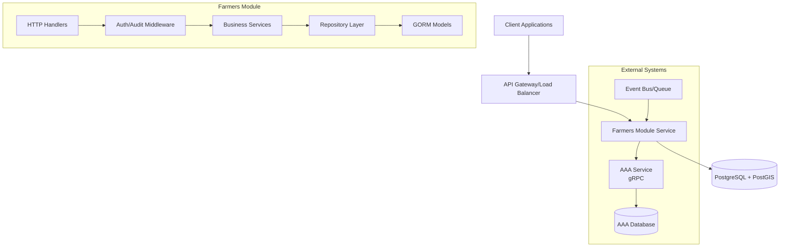
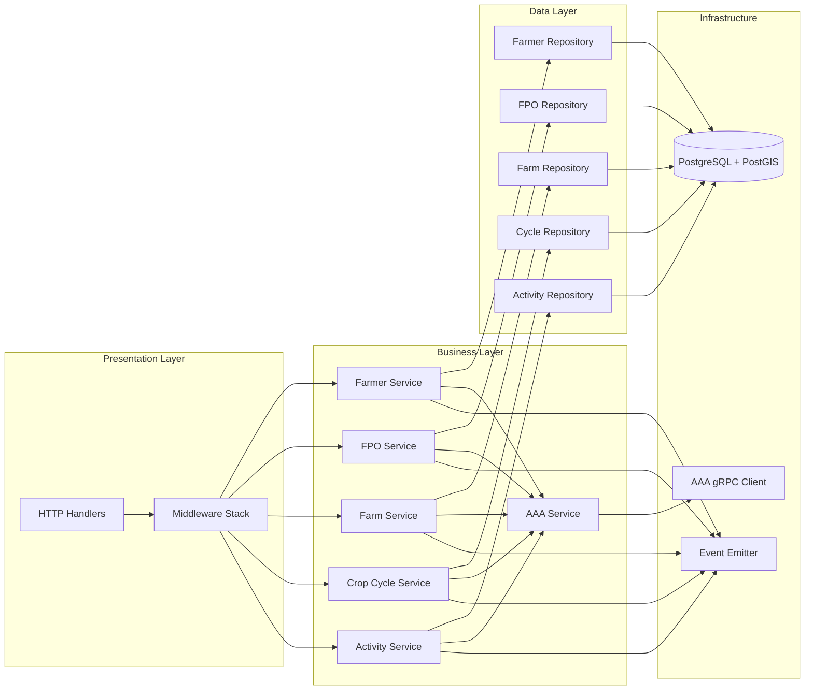

# Design Document

## Overview

The farmers-module service is a Go-based microservice that manages farmer registration, FPO (Farmer Producer Organization) relationships, farm geospatial data, and agricultural workflows. The service follows a layered architecture with clear separation of concerns, integrating with PostgreSQL/PostGIS for data persistence and an external AAA service for authentication and authorization via gRPC.

### Key Design Principles

- **Domain-Driven Design**: Clear domain boundaries with entities, repositories, and services
- **Microservice Architecture**: Stateless service with external dependencies (AAA, Database)
- **Security-First**: All operations authenticated and authorized through AAA service
- **Geospatial-Aware**: PostGIS integration for farm boundary management and spatial queries
- **Event-Driven**: Emit structured events for audit trails and system integration
- **Testable**: Comprehensive testing strategy with mocks and integration tests

## Architecture

### High-Level Architecture



### Service Layer Architecture



## Components and Interfaces

### 1. Database Layer

#### Database Connection and Setup

- **PostgresManager**: Uses kisanlink-db package for connection management
- **PostGIS Extension**: Enabled for geospatial operations
- **ENUM Types**: Custom enums for season, cycle_status, activity_status, link_status
- **AutoMigrate**: GORM-based schema management
- **Post-Migration Setup**: Computed columns, spatial indexes, constraints

#### Core Models

```go
// Base model embedded in all entities
type BaseModel struct {
    ID        string    `json:"id" gorm:"primaryKey"`
    CreatedAt time.Time `json:"created_at"`
    UpdatedAt time.Time `json:"updated_at"`
    DeletedAt *time.Time `json:"deleted_at,omitempty" gorm:"index"`
}

// Farmer model with AAA integration
type Farmer struct {
    BaseModel
    AAAUserID        string            `json:"aaa_user_id" gorm:"type:varchar(255);not null;uniqueIndex:idx_farmer_unique"`
    AAAOrgID         string            `json:"aaa_org_id" gorm:"type:varchar(255);not null;uniqueIndex:idx_farmer_unique"`
    KisanSathiUserID *string           `json:"kisan_sathi_user_id" gorm:"type:varchar(255)"`
    FirstName        string            `json:"first_name" gorm:"type:varchar(255);not null"`
    LastName         string            `json:"last_name" gorm:"type:varchar(255);not null"`
    PhoneNumber      string            `json:"phone_number" gorm:"type:varchar(50)"`
    Email            string            `json:"email" gorm:"type:varchar(255)"`
    // Additional farmer-specific fields...
    Preferences      map[string]string `json:"preferences" gorm:"type:jsonb"`
    Metadata         map[string]string `json:"metadata" gorm:"type:jsonb"`
}

// FPORef model for organization references
type FPORef struct {
    BaseModel
    AAAOrgID       string            `json:"aaa_org_id" gorm:"type:varchar(255);unique;not null"`
    Name           string            `json:"name" gorm:"type:varchar(255);not null"`
    RegistrationNo string            `json:"registration_no" gorm:"type:varchar(255)"`
    BusinessConfig map[string]string `json:"business_config" gorm:"type:jsonb;default:'{}'"`
    Status         string            `json:"status" gorm:"type:varchar(50);default:'ACTIVE'"`
}

// FarmerLink model for farmer-FPO relationships
type FarmerLink struct {
    BaseModel
    AAAUserID        string  `json:"aaa_user_id" gorm:"type:varchar(255);not null"`
    AAAOrgID         string  `json:"aaa_org_id" gorm:"type:varchar(255);not null"`
    KisanSathiUserID *string `json:"kisan_sathi_user_id" gorm:"type:varchar(255)"`
    Status           string  `json:"status" gorm:"type:varchar(255);not null;default:'ACTIVE'"`
}

// Farm model with PostGIS geometry
type Farm struct {
    BaseModel
    AAAFarmerUserID string            `json:"aaa_farmer_user_id" gorm:"type:varchar(255);not null"`
    AAAOrgID        string            `json:"aaa_org_id" gorm:"type:varchar(255);not null"`
    Geometry        string            `json:"geometry" gorm:"type:geometry(POLYGON,4326)"`
    AreaHa          float64           `json:"area_ha" gorm:"type:numeric(12,4);->"`
    Name            string            `json:"name" gorm:"type:varchar(255)"`
    Metadata        map[string]string `json:"metadata" gorm:"type:jsonb"`
}

// CropCycle model for seasonal farming cycles
type CropCycle struct {
    BaseModel
    FarmID       string            `json:"farm_id" gorm:"type:varchar(255);not null"`
    FarmerID     string            `json:"farmer_id" gorm:"type:varchar(255);not null"`
    Season       string            `json:"season" gorm:"type:season;not null"`
    Status       string            `json:"status" gorm:"type:cycle_status;not null;default:'PLANNED'"`
    StartDate    *time.Time        `json:"start_date"`
    EndDate      *time.Time        `json:"end_date"`
    PlannedCrops []string          `json:"planned_crops" gorm:"type:jsonb"`
    Outcome      map[string]string `json:"outcome" gorm:"type:jsonb"`
}

// FarmActivity model for activity tracking
type FarmActivity struct {
    BaseModel
    CropCycleID   string            `json:"crop_cycle_id" gorm:"type:varchar(255);not null"`
    ActivityType  string            `json:"activity_type" gorm:"type:varchar(255);not null"`
    PlannedAt     *time.Time        `json:"planned_at"`
    CompletedAt   *time.Time        `json:"completed_at"`
    CreatedBy     string            `json:"created_by" gorm:"type:varchar(255);not null"`
    Status        string            `json:"status" gorm:"type:activity_status;not null;default:'PLANNED'"`
    Output        map[string]string `json:"output" gorm:"type:jsonb"`
    Metadata      map[string]string `json:"metadata" gorm:"type:jsonb"`
}
```

### 2. Repository Layer

#### Repository Interfaces

```go
type FarmerRepository interface {
    Create(ctx context.Context, farmer *Farmer) error
    GetByID(ctx context.Context, id string) (*Farmer, error)
    GetByAAAUserID(ctx context.Context, aaaUserID string) (*Farmer, error)
    Update(ctx context.Context, farmer *Farmer) error
    Delete(ctx context.Context, id string) error
    List(ctx context.Context, filters FarmerFilters) ([]*Farmer, error)
}

type FPORefRepository interface {
    Create(ctx context.Context, fpoRef *FPORef) error
    GetByID(ctx context.Context, id string) (*FPORef, error)
    GetByAAAOrgID(ctx context.Context, aaaOrgID string) (*FPORef, error)
    Update(ctx context.Context, fpoRef *FPORef) error
    Delete(ctx context.Context, id string) error
    List(ctx context.Context, filters FPORefFilters) ([]*FPORef, error)
}

type FarmerLinkRepository interface {
    Create(ctx context.Context, link *FarmerLink) error
    GetByID(ctx context.Context, id string) (*FarmerLink, error)
    GetByUserAndOrg(ctx context.Context, aaaUserID, aaaOrgID string) (*FarmerLink, error)
    Update(ctx context.Context, link *FarmerLink) error
    Delete(ctx context.Context, id string) error
    List(ctx context.Context, filters FarmerLinkFilters) ([]*FarmerLink, error)
}

type FarmRepository interface {
    Create(ctx context.Context, farm *Farm) error
    GetByID(ctx context.Context, id string) (*Farm, error)
    Update(ctx context.Context, farm *Farm) error
    Delete(ctx context.Context, id string) error
    List(ctx context.Context, filters FarmFilters) ([]*Farm, error)
    ListByBoundingBox(ctx context.Context, bbox BoundingBox, filters FarmFilters) ([]*Farm, error)
    ValidateGeometry(ctx context.Context, wkt string) error
}

type CropCycleRepository interface {
    Create(ctx context.Context, cycle *CropCycle) error
    GetByID(ctx context.Context, id string) (*CropCycle, error)
    Update(ctx context.Context, cycle *CropCycle) error
    Delete(ctx context.Context, id string) error
    List(ctx context.Context, filters CropCycleFilters) ([]*CropCycle, error)
}

type FarmActivityRepository interface {
    Create(ctx context.Context, activity *FarmActivity) error
    GetByID(ctx context.Context, id string) (*FarmActivity, error)
    Update(ctx context.Context, activity *FarmActivity) error
    Delete(ctx context.Context, id string) error
    List(ctx context.Context, filters FarmActivityFilters) ([]*FarmActivity, error)
}
```

### 3. Service Layer

#### Service Interfaces

```go
type FarmerService interface {
    RegisterFarmer(ctx context.Context, req *RegisterFarmerRequest) (*RegisterFarmerResponse, error)
    GetFarmer(ctx context.Context, req *GetFarmerRequest) (*GetFarmerResponse, error)
    UpdateFarmer(ctx context.Context, req *UpdateFarmerRequest) (*UpdateFarmerResponse, error)
    ListFarmers(ctx context.Context, req *ListFarmersRequest) (*ListFarmersResponse, error)
}

type FPOService interface {
    CreateFPO(ctx context.Context, req *CreateFPORequest) (*CreateFPOResponse, error)
    RegisterFPORef(ctx context.Context, req *RegisterFPORefRequest) (*RegisterFPORefResponse, error)
    GetFPORef(ctx context.Context, req *GetFPORefRequest) (*GetFPORefResponse, error)
}

type FarmerLinkageService interface {
    LinkFarmerToFPO(ctx context.Context, req *LinkFarmerToFPORequest) (*LinkFarmerToFPOResponse, error)
    UnlinkFarmerFromFPO(ctx context.Context, req *UnlinkFarmerFromFPORequest) (*UnlinkFarmerFromFPOResponse, error)
    AssignKisanSathi(ctx context.Context, req *AssignKisanSathiRequest) (*AssignKisanSathiResponse, error)
    ReassignOrRemoveKisanSathi(ctx context.Context, req *ReassignKisanSathiRequest) (*ReassignKisanSathiResponse, error)
}

type FarmService interface {
    CreateFarm(ctx context.Context, req *CreateFarmRequest) (*CreateFarmResponse, error)
    UpdateFarm(ctx context.Context, req *UpdateFarmRequest) (*UpdateFarmResponse, error)
    DeleteFarm(ctx context.Context, req *DeleteFarmRequest) (*DeleteFarmResponse, error)
    ListFarms(ctx context.Context, req *ListFarmsRequest) (*ListFarmsResponse, error)
    GetFarm(ctx context.Context, req *GetFarmRequest) (*GetFarmResponse, error)
}

type CropCycleService interface {
    StartCycle(ctx context.Context, req *StartCycleRequest) (*StartCycleResponse, error)
    UpdateCycle(ctx context.Context, req *UpdateCycleRequest) (*UpdateCycleResponse, error)
    EndCycle(ctx context.Context, req *EndCycleRequest) (*EndCycleResponse, error)
    ListCycles(ctx context.Context, req *ListCyclesRequest) (*ListCyclesResponse, error)
}

type FarmActivityService interface {
    CreateActivity(ctx context.Context, req *CreateActivityRequest) (*CreateActivityResponse, error)
    CompleteActivity(ctx context.Context, req *CompleteActivityRequest) (*CompleteActivityResponse, error)
    UpdateActivity(ctx context.Context, req *UpdateActivityRequest) (*UpdateActivityResponse, error)
    ListActivities(ctx context.Context, req *ListActivitiesRequest) (*ListActivitiesResponse, error)
}
```

### 4. AAA Integration Layer

#### AAA Client Interface

```go
type AAAClient interface {
    // User Management
    CreateUser(ctx context.Context, req *CreateUserRequest) (*CreateUserResponse, error)
    GetUser(ctx context.Context, userID string) (*UserData, error)
    GetUserByPhone(ctx context.Context, phone string) (*UserData, error)
    GetUserByEmail(ctx context.Context, email string) (*UserData, error)

    // Organization Management
    CreateOrganization(ctx context.Context, req *CreateOrganizationRequest) (*CreateOrganizationResponse, error)
    GetOrganization(ctx context.Context, orgID string) (*OrganizationData, error)

    // User Group Management
    CreateUserGroup(ctx context.Context, req *CreateUserGroupRequest) (*CreateUserGroupResponse, error)
    AddUserToGroup(ctx context.Context, userID, groupID string) error
    RemoveUserFromGroup(ctx context.Context, userID, groupID string) error

    // Role and Permission Management
    AssignRole(ctx context.Context, userID, orgID, roleName string) error
    CheckUserRole(ctx context.Context, userID, roleName string) (bool, error)
    AssignPermissionToGroup(ctx context.Context, groupID, resource, action string) error

    // Authorization
    CheckPermission(ctx context.Context, subject, resource, action, object, orgID string) (bool, error)

    // System Management
    SeedRolesAndPermissions(ctx context.Context) error
    HealthCheck(ctx context.Context) error
}
```

### 5. Middleware Layer

#### Authentication Middleware

- Extracts JWT token from Authorization header
- Validates token with AAA service
- Sets user context (aaa_subject, aaa_org) in request context

#### Authorization Middleware

- Maps HTTP routes to (resource, action) tuples
- Calls AAA CheckPermission with user context
- Returns 403 Forbidden for unauthorized requests

#### Audit Middleware

- Logs all requests with structured JSON format
- Includes subject, org, resource, action, status, correlation ID
- Emits audit events for downstream processing

#### Error Handling Middleware

- Catches panics and converts to structured errors
- Maps GORM errors to appropriate HTTP status codes
- Returns consistent JSON error responses with correlation IDs

## Data Models

### Request/Response Models

#### Farmer Registration

```go
type RegisterFarmerRequest struct {
    FirstName       string            `json:"first_name" validate:"required"`
    LastName        string            `json:"last_name" validate:"required"`
    PhoneNumber     string            `json:"phone_number" validate:"required,phone"`
    Email           string            `json:"email" validate:"email"`
    Password        string            `json:"password" validate:"required,min=8"`
    DateOfBirth     string            `json:"date_of_birth"`
    Gender          string            `json:"gender"`
    Address         AddressData       `json:"address"`
    Preferences     map[string]string `json:"preferences"`
    Metadata        map[string]string `json:"metadata"`
}

type RegisterFarmerResponse struct {
    FarmerID    string    `json:"farmer_id"`
    AAAUserID   string    `json:"aaa_user_id"`
    Status      string    `json:"status"`
    CreatedAt   time.Time `json:"created_at"`
    Message     string    `json:"message"`
}
```

#### FPO Creation

```go
type CreateFPORequest struct {
    Name           string            `json:"name" validate:"required"`
    RegistrationNo string            `json:"registration_no" validate:"required"`
    Description    string            `json:"description"`
    CEOUser        CEOUserData       `json:"ceo_user" validate:"required"`
    BusinessConfig map[string]string `json:"business_config"`
    Metadata       map[string]string `json:"metadata"`
}

type CreateFPOResponse struct {
    FPOID         string              `json:"fpo_id"`
    AAAOrgID      string              `json:"aaa_org_id"`
    CEOUserID     string              `json:"ceo_user_id"`
    UserGroups    []UserGroupData     `json:"user_groups"`
    Status        string              `json:"status"`
    CreatedAt     time.Time           `json:"created_at"`
    Message       string              `json:"message"`
}
```

#### Farm Management

```go
type CreateFarmRequest struct {
    Name        string            `json:"name" validate:"required"`
    Geometry    string            `json:"geometry" validate:"required,wkt"`
    Metadata    map[string]string `json:"metadata"`
}

type CreateFarmResponse struct {
    FarmID      string            `json:"farm_id"`
    Name        string            `json:"name"`
    Geometry    string            `json:"geometry"`
    AreaHa      float64           `json:"area_ha"`
    Metadata    map[string]string `json:"metadata"`
    CreatedAt   time.Time         `json:"created_at"`
    Message     string            `json:"message"`
}
```

### Error Models

```go
type ErrorResponse struct {
    Error         string            `json:"error"`
    Message       string            `json:"message"`
    Code          string            `json:"code"`
    CorrelationID string            `json:"correlation_id"`
    Details       map[string]string `json:"details,omitempty"`
    Timestamp     time.Time         `json:"timestamp"`
}

type ValidationError struct {
    Field   string `json:"field"`
    Message string `json:"message"`
    Value   string `json:"value"`
}
```

## Error Handling

### Error Classification

1. **Validation Errors (400)**: Invalid input data, WKT format errors
2. **Authentication Errors (401)**: Invalid or missing JWT tokens
3. **Authorization Errors (403)**: Insufficient permissions
4. **Not Found Errors (404)**: Resource not found
5. **Conflict Errors (409)**: Duplicate resources, constraint violations
6. **Service Unavailable (503)**: AAA service down, database connection issues
7. **Internal Server Errors (500)**: Unexpected system errors

### Error Handling Strategy

- Structured error responses with correlation IDs
- GORM error mapping to HTTP status codes
- AAA service error propagation with context
- Comprehensive logging with structured JSON
- Circuit breaker pattern for AAA service calls
- Graceful degradation when possible

## Testing Strategy

### Unit Testing

- Repository layer with database mocks
- Service layer with repository mocks
- AAA client with gRPC mocks
- Middleware components with HTTP mocks
- Validation logic and business rules

### Integration Testing

- Database integration with test containers
- AAA service integration with test doubles
- End-to-end API testing with real database
- Geospatial operations with PostGIS test data

### Performance Testing

- Load testing for concurrent requests
- Database query performance optimization
- AAA service call latency measurement
- Memory usage and garbage collection monitoring

### Test Data Management

- Test fixtures for all domain entities
- Geospatial test data with valid WKT polygons
- AAA service mock responses
- Database seeding and cleanup utilities

## Security Considerations

### Authentication

- JWT token validation through AAA service
- Token expiration and refresh handling
- Secure token storage and transmission

### Authorization

- Fine-grained permissions per resource and action
- Organization-scoped access control
- Role-based access control (RBAC)
- Principle of least privilege

### Data Protection

- Sensitive data encryption at rest
- Secure communication with TLS
- Input validation and sanitization
- SQL injection prevention through GORM

### Audit and Compliance

- Comprehensive audit logging
- Data access tracking
- Compliance with data protection regulations
- Secure data retention and deletion

## Performance Considerations

### Database Optimization

- Proper indexing strategy for spatial and regular queries
- Connection pooling and timeout management
- Query optimization for large datasets
- Database partitioning for historical data

### Caching Strategy

- AAA service response caching
- Database query result caching
- Geospatial query optimization
- Cache invalidation strategies

### Scalability

- Stateless service design for horizontal scaling
- Database read replicas for query scaling
- Asynchronous processing for heavy operations
- Load balancing and service discovery

## Deployment and Operations

### Configuration Management

- Environment-based configuration
- Secure secret management
- Feature flags for gradual rollouts
- Configuration validation and defaults

### Monitoring and Observability

- Structured logging with correlation IDs
- Metrics collection and alerting
- Distributed tracing for request flows
- Health checks and readiness probes

### Disaster Recovery

- Database backup and restore procedures
- Service failover and recovery
- Data consistency and integrity checks
- Business continuity planning
