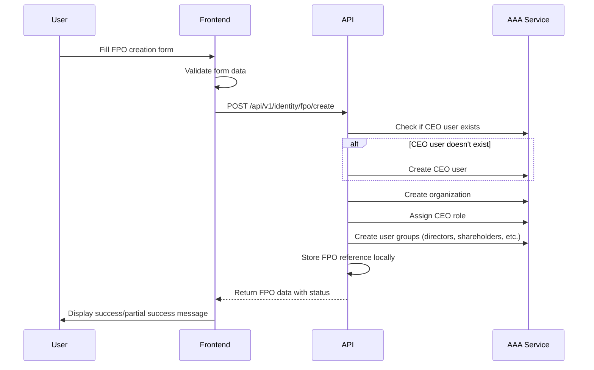

# FPO Setup - Frontend Integration Guide

## Overview

This guide explains how to integrate FPO (Farmer Producer Organization) creation and management workflows in your frontend application. The FPO setup process involves creating an organization in the AAA (Authentication, Authorization, and Audit) service along with CEO user setup and initial user groups.

## Table of Contents

1. [API Endpoints](#api-endpoints)
2. [FPO Creation Workflow](#fpo-creation-workflow)
3. [Request/Response Formats](#requestresponse-formats)
4. [Error Handling](#error-handling)
5. [Setup Status Management](#setup-status-management)
6. [UI/UX Recommendations](#uiux-recommendations)
7. [Code Examples](#code-examples)

---

## API Endpoints

### 1. Create FPO Organization
**POST** `/api/v1/identity/fpo/create`

Creates a new FPO organization with CEO user setup and user groups.

### 2. Register FPO Reference
**POST** `/api/v1/identity/fpo/register`

Registers an existing FPO organization for local reference management (when FPO already exists in AAA).

### 3. Get FPO Reference
**GET** `/api/v1/identity/fpo/reference/{aaa_org_id}`

Retrieves FPO reference information by AAA organization ID.

### 4. Complete FPO Setup
**POST** `/api/v1/identity/fpo/setup/complete/{aaa_org_id}`

Retries failed setup operations for FPOs in PENDING_SETUP status.

---

## FPO Creation Workflow

### Step-by-Step Process



### Key Points

1. **CEO User Creation**:
   - If CEO user exists (by phone number), password is NOT required
   - If CEO user doesn't exist, password IS required (min 8 characters)

2. **Automatic Setup**:
   - CEO role assignment to the user
   - Creation of 4 default user groups:
     - `directors` - Full management permissions
     - `shareholders` - Read and vote permissions
     - `store_staff` - Read, write, inventory permissions
     - `store_managers` - Full store management permissions

3. **Partial Failure Handling**:
   - If any setup step fails, FPO is marked as `PENDING_SETUP`
   - FPO can still be used, but setup should be completed later

---

## Request/Response Formats

### Create FPO Request

```typescript
interface CreateFPORequest {
  // FPO Information
  name: string;                    // Required: FPO name
  registration_number: string;     // Required: Official registration number
  description?: string;            // Optional: FPO description

  // CEO User Information
  ceo_user: {
    first_name: string;            // Required
    last_name: string;             // Required
    phone_number: string;          // Required: Format +91XXXXXXXXXX
    email?: string;                // Optional
    password?: string;             // Required if user doesn't exist (min 8 chars)
  };

  // Optional Business Configuration
  business_config?: {
    erp_enabled?: boolean;
    erp_organization_id?: string;
    procurement_enabled?: boolean;
    // ... other config
  };

  // Optional Metadata
  metadata?: Record<string, any>;
}
```

### Create FPO Response (Success)

```typescript
interface CreateFPOResponse {
  request_id: string;
  message: string;                 // "FPO created successfully"
  timestamp: string;               // ISO 8601 format
  data: {
    fpo_id: string;                // Local FPO reference ID
    aaa_org_id: string;            // AAA organization ID
    name: string;
    ceo_user_id: string;           // AAA user ID of CEO
    user_groups: Array<{
      group_id: string;
      name: string;                // "directors", "shareholders", etc.
      org_id: string;
      created_at: string;
      permissions: string[];
    }>;
    status: string;                // "ACTIVE" or "PENDING_SETUP"
    created_at: string;
  };
}
```

### Create FPO Response (Partial Success - PENDING_SETUP)

When `status` is `"PENDING_SETUP"`, some setup steps failed but the FPO was created:

```typescript
{
  "request_id": "req-123",
  "message": "FPO created with incomplete setup. Some user groups or permissions may need to be configured manually.",
  "timestamp": "2025-11-18T14:35:32Z",
  "data": {
    "fpo_id": "FPO1234567890",
    "aaa_org_id": "ORGN00000123",
    "name": "Sree Rama FPO",
    "ceo_user_id": "USER00000456",
    "user_groups": [
      // May be empty or partial if group creation failed
    ],
    "status": "PENDING_SETUP",  // ⚠️ Important: Check this field
    "created_at": "2025-11-18T14:35:32Z"
  }
}
```

---

## Error Handling

### Common Error Scenarios

#### 1. CEO User Already CEO of Another FPO
**Status Code**: 400 Bad Request

```json
{
  "error": "user is already CEO of another FPO - a user cannot be CEO of multiple FPOs simultaneously"
}
```

**Frontend Action**: Show error message and suggest using a different user as CEO.

---

#### 2. Password Required for New CEO User
**Status Code**: 400 Bad Request

```json
{
  "error": "password is required when creating a new CEO user"
}
```

**Frontend Action**:
- Check if user exists before showing password field
- Make password required in form validation

---

#### 3. Duplicate FPO Registration Number
**Status Code**: 409 Conflict (if implemented)

```json
{
  "error": "FPO with this registration number already exists"
}
```

**Frontend Action**: Show error and suggest checking existing FPOs.

---

#### 4. Invalid Organization Type
**Status Code**: 500 Internal Server Error

```json
{
  "error": "failed to create organization: Field validation for 'Type' failed on the 'oneof' tag"
}
```

**Frontend Action**: This should not happen in production. Contact backend team if it does.

---

#### 5. AAA Service Unavailable
**Status Code**: 500 Internal Server Error

```json
{
  "error": "failed to create organization: AAA service unavailable"
}
```

**Frontend Action**: Show user-friendly error and retry button.

---

### Error Handling Best Practices

```typescript
async function createFPO(data: CreateFPORequest): Promise<CreateFPOResponse> {
  try {
    const response = await fetch('/api/v1/identity/fpo/create', {
      method: 'POST',
      headers: {
        'Content-Type': 'application/json',
        'Authorization': `Bearer ${authToken}`,
      },
      body: JSON.stringify(data),
    });

    if (!response.ok) {
      const errorData = await response.json();

      // Handle specific error cases
      if (response.status === 400) {
        if (errorData.error?.includes('already CEO')) {
          throw new Error('This user is already CEO of another FPO. Please select a different user.');
        }
        if (errorData.error?.includes('password is required')) {
          throw new Error('Password is required for new CEO user registration.');
        }
      }

      if (response.status === 409) {
        throw new Error('An FPO with this registration number already exists.');
      }

      if (response.status === 500) {
        if (errorData.error?.includes('AAA service unavailable')) {
          throw new Error('Service temporarily unavailable. Please try again.');
        }
      }

      // Generic error
      throw new Error(errorData.error || 'Failed to create FPO');
    }

    const result = await response.json();

    // Check for PENDING_SETUP status
    if (result.data.status === 'PENDING_SETUP') {
      console.warn('FPO created with incomplete setup:', result.data.fpo_id);
      // Show warning to user but allow them to proceed
    }

    return result;
  } catch (error) {
    console.error('FPO creation failed:', error);
    throw error;
  }
}
```

---

## Setup Status Management

### FPO Status Values

| Status | Description | Action Required |
|--------|-------------|-----------------|
| `ACTIVE` | FPO fully configured and ready to use | None |
| `PENDING_SETUP` | FPO created but some setup steps failed | Complete setup |
| `SUSPENDED` | FPO temporarily disabled | Contact admin |
| `ARCHIVED` | FPO no longer active | None |

### Handling PENDING_SETUP Status

When an FPO has `PENDING_SETUP` status:

1. **Display Warning Badge**: Show a visual indicator that setup is incomplete
2. **Allow Limited Operations**: User can still access the FPO but certain features may not work
3. **Provide Complete Setup Action**: Add a button to complete the setup

```typescript
interface FPOCardProps {
  fpo: FPOData;
}

function FPOCard({ fpo }: FPOCardProps) {
  const handleCompleteSetup = async () => {
    try {
      const response = await fetch(
        `/api/v1/identity/fpo/setup/complete/${fpo.aaa_org_id}`,
        {
          method: 'POST',
          headers: {
            'Authorization': `Bearer ${authToken}`,
          },
        }
      );

      if (response.ok) {
        // Refresh FPO data
        toast.success('FPO setup completed successfully!');
      }
    } catch (error) {
      toast.error('Failed to complete FPO setup. Please try again.');
    }
  };

  return (
    <div className="fpo-card">
      <h3>{fpo.name}</h3>

      {fpo.status === 'PENDING_SETUP' && (
        <div className="warning-banner">
          <Icon name="warning" />
          <span>Setup incomplete - some features may be unavailable</span>
          <button onClick={handleCompleteSetup}>
            Complete Setup
          </button>
        </div>
      )}

      {/* ... rest of FPO card content ... */}
    </div>
  );
}
```

---

## UI/UX Recommendations

### 1. CEO User Creation Form

**Smart Form Behavior**:
```typescript
function FPOCreationForm() {
  const [phoneNumber, setPhoneNumber] = useState('');
  const [userExists, setUserExists] = useState<boolean | null>(null);
  const [loading, setLoading] = useState(false);

  // Check if user exists when phone number is entered
  const checkUserExists = async (phone: string) => {
    if (!phone || phone.length < 10) return;

    setLoading(true);
    try {
      const response = await fetch(
        `/api/v1/identity/users/check?phone=${encodeURIComponent(phone)}`,
        {
          headers: { 'Authorization': `Bearer ${authToken}` }
        }
      );

      setUserExists(response.ok);
    } catch {
      setUserExists(false);
    } finally {
      setLoading(false);
    }
  };

  return (
    <form>
      {/* ... other fields ... */}

      <input
        type="tel"
        value={phoneNumber}
        onChange={(e) => {
          setPhoneNumber(e.target.value);
          checkUserExists(e.target.value);
        }}
        placeholder="+91XXXXXXXXXX"
      />

      {userExists === true && (
        <div className="info-message">
          ✓ User exists - password not required
        </div>
      )}

      {userExists === false && (
        <>
          <div className="info-message">
            New user will be created - password required
          </div>
          <input
            type="password"
            required
            minLength={8}
            placeholder="CEO user password (min 8 characters)"
          />
        </>
      )}
    </form>
  );
}
```

### 2. Progress Indicators

Show clear feedback during the creation process:

```typescript
function CreateFPOButton({ formData }: { formData: CreateFPORequest }) {
  const [status, setStatus] = useState<'idle' | 'creating' | 'success' | 'error'>('idle');
  const [progress, setProgress] = useState(0);

  const handleCreate = async () => {
    setStatus('creating');
    setProgress(0);

    try {
      // Simulate progress
      setProgress(20); // Validating...

      const result = await createFPO(formData);

      setProgress(100);
      setStatus('success');

      // Show different message based on status
      if (result.data.status === 'PENDING_SETUP') {
        toast.warning(
          'FPO created successfully, but some setup steps need attention.',
          { duration: 5000 }
        );
      } else {
        toast.success('FPO created successfully!');
      }

      // Navigate to FPO details page
      router.push(`/fpo/${result.data.fpo_id}`);

    } catch (error) {
      setStatus('error');
      toast.error(error.message);
    }
  };

  return (
    <>
      <button
        onClick={handleCreate}
        disabled={status === 'creating'}
      >
        {status === 'creating' ? 'Creating FPO...' : 'Create FPO'}
      </button>

      {status === 'creating' && (
        <ProgressBar value={progress} />
      )}
    </>
  );
}
```

### 3. Setup Completion UI

Provide clear guidance for completing pending setup:

```typescript
function PendingSetupAlert({ fpoId, aaaOrgId }: Props) {
  const [setupErrors, setSetupErrors] = useState<string[]>([]);
  const [isCompleting, setIsCompleting] = useState(false);

  useEffect(() => {
    // Fetch setup errors from FPO details
    fetchSetupErrors(fpoId).then(setSetupErrors);
  }, [fpoId]);

  const completeSetup = async () => {
    setIsCompleting(true);
    try {
      await fetch(`/api/v1/identity/fpo/setup/complete/${aaaOrgId}`, {
        method: 'POST',
        headers: { 'Authorization': `Bearer ${authToken}` }
      });

      toast.success('Setup completed successfully!');
      window.location.reload(); // Refresh to show updated status

    } catch (error) {
      toast.error('Failed to complete setup. Please contact support.');
    } finally {
      setIsCompleting(false);
    }
  };

  return (
    <div className="alert alert-warning">
      <h4>⚠️ FPO Setup Incomplete</h4>
      <p>The following setup steps need attention:</p>
      <ul>
        {setupErrors.map((error, i) => (
          <li key={i}>{error}</li>
        ))}
      </ul>
      <button
        onClick={completeSetup}
        disabled={isCompleting}
        className="btn-primary"
      >
        {isCompleting ? 'Completing Setup...' : 'Complete Setup Now'}
      </button>
    </div>
  );
}
```

---

## Code Examples

### Complete React Form Component

```typescript
import { useState } from 'react';
import { useForm } from 'react-hook-form';
import { zodResolver } from '@hookform/resolvers/zod';
import { z } from 'zod';

// Validation schema
const fpoSchema = z.object({
  name: z.string().min(1, 'FPO name is required').max(100),
  registration_number: z.string().min(1, 'Registration number is required'),
  description: z.string().optional(),
  ceo_user: z.object({
    first_name: z.string().min(1, 'First name is required'),
    last_name: z.string().min(1, 'Last name is required'),
    phone_number: z.string().regex(/^\+91\d{10}$/, 'Invalid phone number format'),
    email: z.string().email().optional().or(z.literal('')),
    password: z.string().min(8, 'Password must be at least 8 characters').optional(),
  }),
  business_config: z.object({
    erp_enabled: z.boolean().optional(),
    procurement_enabled: z.boolean().optional(),
  }).optional(),
});

type FPOFormData = z.infer<typeof fpoSchema>;

export function CreateFPOForm() {
  const [isSubmitting, setIsSubmitting] = useState(false);
  const [userExists, setUserExists] = useState<boolean | null>(null);

  const {
    register,
    handleSubmit,
    watch,
    formState: { errors },
  } = useForm<FPOFormData>({
    resolver: zodResolver(fpoSchema),
  });

  const phoneNumber = watch('ceo_user.phone_number');

  // Check if user exists
  useEffect(() => {
    if (phoneNumber && phoneNumber.match(/^\+91\d{10}$/)) {
      checkUserExists(phoneNumber);
    }
  }, [phoneNumber]);

  const checkUserExists = async (phone: string) => {
    try {
      const response = await fetch(
        `/api/v1/identity/users/check?phone=${encodeURIComponent(phone)}`,
        { headers: { 'Authorization': `Bearer ${getAuthToken()}` } }
      );
      setUserExists(response.ok);
    } catch {
      setUserExists(false);
    }
  };

  const onSubmit = async (data: FPOFormData) => {
    setIsSubmitting(true);

    try {
      const response = await fetch('/api/v1/identity/fpo/create', {
        method: 'POST',
        headers: {
          'Content-Type': 'application/json',
          'Authorization': `Bearer ${getAuthToken()}`,
        },
        body: JSON.stringify(data),
      });

      if (!response.ok) {
        const error = await response.json();
        throw new Error(error.error || 'Failed to create FPO');
      }

      const result = await response.json();

      // Handle success
      if (result.data.status === 'PENDING_SETUP') {
        alert('FPO created successfully, but setup is incomplete. Please complete the setup from the FPO dashboard.');
      } else {
        alert('FPO created successfully!');
      }

      // Navigate to FPO details
      window.location.href = `/fpo/${result.data.fpo_id}`;

    } catch (error) {
      alert(error.message);
    } finally {
      setIsSubmitting(false);
    }
  };

  return (
    <form onSubmit={handleSubmit(onSubmit)} className="space-y-6">
      <h2>Create New FPO</h2>

      {/* FPO Information */}
      <section>
        <h3>FPO Information</h3>

        <div>
          <label>FPO Name *</label>
          <input {...register('name')} />
          {errors.name && <span className="error">{errors.name.message}</span>}
        </div>

        <div>
          <label>Registration Number *</label>
          <input {...register('registration_number')} />
          {errors.registration_number && (
            <span className="error">{errors.registration_number.message}</span>
          )}
        </div>

        <div>
          <label>Description</label>
          <textarea {...register('description')} rows={3} />
        </div>
      </section>

      {/* CEO User Information */}
      <section>
        <h3>CEO User Information</h3>

        <div>
          <label>First Name *</label>
          <input {...register('ceo_user.first_name')} />
          {errors.ceo_user?.first_name && (
            <span className="error">{errors.ceo_user.first_name.message}</span>
          )}
        </div>

        <div>
          <label>Last Name *</label>
          <input {...register('ceo_user.last_name')} />
          {errors.ceo_user?.last_name && (
            <span className="error">{errors.ceo_user.last_name.message}</span>
          )}
        </div>

        <div>
          <label>Phone Number * (Format: +91XXXXXXXXXX)</label>
          <input {...register('ceo_user.phone_number')} placeholder="+91XXXXXXXXXX" />
          {errors.ceo_user?.phone_number && (
            <span className="error">{errors.ceo_user.phone_number.message}</span>
          )}

          {userExists === true && (
            <div className="info-message success">
              ✓ User exists - password not required
            </div>
          )}
          {userExists === false && (
            <div className="info-message warning">
              New user will be created - password required
            </div>
          )}
        </div>

        <div>
          <label>Email (Optional)</label>
          <input type="email" {...register('ceo_user.email')} />
        </div>

        {userExists === false && (
          <div>
            <label>Password * (Minimum 8 characters)</label>
            <input
              type="password"
              {...register('ceo_user.password')}
              minLength={8}
              required
            />
            {errors.ceo_user?.password && (
              <span className="error">{errors.ceo_user.password.message}</span>
            )}
          </div>
        )}
      </section>

      {/* Business Configuration (Optional) */}
      <section>
        <h3>Business Configuration (Optional)</h3>

        <div>
          <label>
            <input type="checkbox" {...register('business_config.erp_enabled')} />
            Enable ERP Integration
          </label>
        </div>

        <div>
          <label>
            <input type="checkbox" {...register('business_config.procurement_enabled')} />
            Enable Procurement Module
          </label>
        </div>
      </section>

      <button
        type="submit"
        disabled={isSubmitting}
        className="btn-primary"
      >
        {isSubmitting ? 'Creating FPO...' : 'Create FPO'}
      </button>
    </form>
  );
}
```

---

## Testing Checklist

### Manual Testing Scenarios

- [ ] Create FPO with new CEO user (password required)
- [ ] Create FPO with existing CEO user (password not required)
- [ ] Handle CEO already assigned to another FPO
- [ ] Handle duplicate registration number
- [ ] Handle AAA service unavailable error
- [ ] Handle PENDING_SETUP status (simulate by stopping AAA service mid-creation)
- [ ] Complete setup for PENDING_SETUP FPO
- [ ] Verify all user groups are created
- [ ] Verify CEO role is assigned correctly
- [ ] Test form validation (required fields, phone format, password length)

### API Integration Testing

```typescript
describe('FPO Creation API', () => {
  it('should create FPO with new CEO user', async () => {
    const data = {
      name: 'Test FPO',
      registration_number: 'REG123456',
      ceo_user: {
        first_name: 'John',
        last_name: 'Doe',
        phone_number: '+919876543210',
        password: 'SecurePassword123',
      },
    };

    const response = await createFPO(data);

    expect(response.data.status).toBe('ACTIVE');
    expect(response.data.user_groups).toHaveLength(4);
  });

  it('should handle existing CEO user', async () => {
    const data = {
      name: 'Test FPO 2',
      registration_number: 'REG789012',
      ceo_user: {
        first_name: 'Jane',
        last_name: 'Smith',
        phone_number: '+919876543210', // Existing user
        // No password needed
      },
    };

    const response = await createFPO(data);
    expect(response.data.status).toBe('ACTIVE');
  });
});
```

---

## Support & Troubleshooting

### Common Issues

**Issue**: "Password is required" error even though user exists
**Solution**: Verify the phone number format is exactly `+91XXXXXXXXXX` (no spaces)

**Issue**: FPO stuck in PENDING_SETUP status
**Solution**: Use the "Complete Setup" button or API endpoint to retry failed operations

**Issue**: Cannot create multiple FPOs
**Solution**: Each CEO can only be assigned to one FPO. Use different users as CEOs for multiple FPOs.

### Contact

For backend API issues or questions, contact the backend team or refer to:
- API Specification: `/api/v1/docs` (Swagger UI)
- ADR-002: FPO-AAA Integration Architecture
- Implementation Plan: `.kiro/specs/fpo-aaa-integration/IMPLEMENTATION_PLAN.md`

---

## Changelog

| Version | Date | Changes |
|---------|------|---------|
| 1.0.0 | 2025-11-18 | Initial frontend integration guide |
