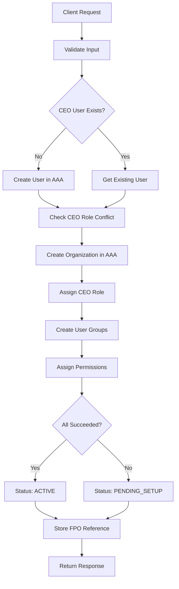

# FPO-AAA Integration Documentation

**Status**: ✅ Complete and Operational

**Last Updated**: 2025-11-17

## Overview

This folder contains comprehensive documentation for the FPO (Farmer Producer Organization) registration and AAA (Authentication, Authorization, Audit) service integration.

**Key Finding**: The integration between FPO registration and AAA organization creation is **already fully implemented and working**. No additional coding required.

## Quick Links

| Document | Purpose |
|----------|---------|
| [IMPLEMENTATION_STATUS.md](./IMPLEMENTATION_STATUS.md) | Complete technical implementation details |
| [API_GUIDE.md](./API_GUIDE.md) | API usage guide with examples |
| [TEST_SCENARIOS.md](./TEST_SCENARIOS.md) | Comprehensive test scenarios |
| [FIELD_NAME_FIX.md](./FIELD_NAME_FIX.md) | Fix for registration_number validation issue |

## Executive Summary

### What's Working

The `/api/v1/identity/fpo/create` endpoint successfully:

1. ✅ **Creates CEO User** in AAA service (or reuses existing)
2. ✅ **Creates Organization** in AAA service
3. ✅ **Assigns CEO Role** to the user
4. ✅ **Creates User Groups** (directors, shareholders, store_staff, store_managers)
5. ✅ **Assigns Permissions** to each group
6. ✅ **Stores FPO Reference** in local database
7. ✅ **Handles Partial Failures** with PENDING_SETUP status
8. ✅ **Provides Recovery** via CompleteFPOSetup endpoint

### The Issue

There's a **field name mismatch** causing validation errors:
- **Correct field**: `registration_number`
- **Common error**: Using `registration_number`

**Resolution**: Update API consumers to use `registration_number` (see [FIELD_NAME_FIX.md](./FIELD_NAME_FIX.md))

## Architecture Overview

### Request Flow

```
Client
  ↓
  POST /api/v1/identity/fpo/create
  ↓
Handler (fpo_handlers.go)
  ↓
FPO Service (fpo_ref_service.go)
  ↓
├─→ AAA Service (aaa_service.go)
│     ↓
│   AAA Client (aaa_client.go)
│     ↓
│   gRPC → AAA Service
│     ↓
│   Returns: user_id, org_id, group_ids
│
└─→ Local Database
      ↓
    FPO Reference (fpo_refs table)
```

### Data Flow



## Key Components

### Files

| File | Purpose | Lines of Interest |
|------|---------|-------------------|
| `/internal/handlers/fpo_handlers.go` | HTTP request handling | Line 43: CreateFPO |
| `/internal/services/fpo_ref_service.go` | Business logic | Lines 36-234: CreateFPO implementation |
| `/internal/services/aaa_service.go` | AAA service wrapper | Lines 174-210: CreateOrganization |
| `/internal/clients/aaa/aaa_client.go` | gRPC client | Lines 449-498: CreateOrganization |
| `/internal/entities/requests/fpo_ref.go` | Request models | Line 16: registration_number field |
| `/internal/entities/fpo/fpo.go` | Domain models | Lines 44-97: FPORef model |

### Database Schema

```sql
CREATE TABLE fpo_refs (
    id VARCHAR(255) PRIMARY KEY,
    aaa_org_id VARCHAR(255) UNIQUE NOT NULL,
    name VARCHAR(255) NOT NULL,
    registration_number VARCHAR(255),
    status VARCHAR(50) DEFAULT 'ACTIVE',
    business_config JSONB DEFAULT '{}',
    setup_errors JSONB,
    created_at TIMESTAMP,
    updated_at TIMESTAMP,
    deleted_at TIMESTAMP
);
```

## API Quick Reference

### Endpoint

```
POST /api/v1/identity/fpo/create
```

### Minimal Request

```json
{
  "name": "Rampur Farmers Producer Company",
  "registration_number": "FPO/MP/2024/001234",
  "ceo_user": {
    "first_name": "Rajesh",
    "last_name": "Sharma",
    "phone_number": "+919876543210",
    "password": "SecurePass@123"
  }
}
```

### Response

```json
{
  "success": true,
  "message": "FPO created successfully",
  "request_id": "req_abc123xyz",
  "data": {
    "fpo_id": "FPOR_1234567890",
    "aaa_org_id": "org_987654321",
    "name": "Rampur Farmers Producer Company",
    "ceo_user_id": "user_abc123def",
    "user_groups": [...],
    "status": "ACTIVE",
    "created_at": "2025-11-17T09:00:00Z"
  }
}
```

Full examples in [API_GUIDE.md](./API_GUIDE.md)

## Security Controls

### OWASP ASVS Compliance

- ✅ **V1**: JWT-based authentication
- ✅ **V2**: Stateless session management
- ✅ **V4**: Role-based access control
- ✅ **V5**: Input validation (JSON schema)
- ✅ **V7**: Structured error handling
- ✅ **V8**: TLS for data in transit
- ✅ **V9**: gRPC with TLS 1.2+

### Business Rules

- **BR-1.1**: Partial failure handling with PENDING_SETUP status
- **BR-1.2**: CEO uniqueness (one FPO per user as CEO)
- **BR-1.3**: Idempotency (not currently implemented - future enhancement)

## Performance Characteristics

### Expected Latency

- **P50**: ~500-700ms
- **P95**: ~1000-1500ms
- **P99**: ~2000-3000ms

### Bottlenecks

1. AAA service gRPC calls (4-5 sequential operations)
2. User group creation (4 sequential requests)
3. Database write operations

### Optimization Opportunities

- Batch user group creation (if AAA supports)
- Parallel group creation (with proper error handling)
- Caching for CEO role checks

## Testing

### Test Coverage

| Category | Status | Location |
|----------|--------|----------|
| Unit Tests | ✅ Exist | `/internal/services/fpo_service_test.go` |
| Integration Tests | ⚠️ Partial | Needs AAA mock scenarios |
| E2E Tests | ❌ Needed | Complete workflow testing |
| Performance Tests | ❌ Needed | Load and stress testing |

### Critical Test Scenarios

1. **Happy Path**: New CEO user, full FPO creation
2. **Existing CEO**: Reuse existing user
3. **CEO Conflict**: User already CEO of another FPO
4. **Partial Failure**: AAA group creation fails
5. **Recovery**: CompleteFPOSetup workflow

See [TEST_SCENARIOS.md](./TEST_SCENARIOS.md) for complete test plan (50+ scenarios)

## Common Issues & Solutions

### Issue 1: "FPO registration number is required"

**Cause**: Using `registration_number` instead of `registration_number`

**Fix**: Update request to use correct field name

```diff
{
  "name": "Test FPO",
- "registration_number": "FPO/2024/001",
+ "registration_number": "FPO/2024/001",
  "ceo_user": {...}
}
```

See [FIELD_NAME_FIX.md](./FIELD_NAME_FIX.md) for detailed fix options.

---

### Issue 2: "User is already CEO of another FPO"

**Cause**: Business rule violation (BR-1.2)

**Solutions**:
1. Use different phone number
2. Remove CEO role from previous FPO (admin action)
3. Verify it's not duplicate request for same FPO

---

### Issue 3: Status is "PENDING_SETUP"

**Cause**: Some AAA operations failed (groups, roles)

**Fix**: Call recovery endpoint

```bash
POST /api/v1/identity/fpo/complete-setup
{
  "org_id": "org_987654321"
}
```

---

### Issue 4: AAA Service Unavailable

**Cause**: AAA service down or unreachable

**Immediate Actions**:
1. Check AAA service health
2. Verify network connectivity
3. Check firewall rules
4. Review TLS configuration

**Long-term**:
- Implement circuit breaker
- Add retry logic with exponential backoff
- Set up monitoring and alerting

## Deployment Checklist

### Prerequisites

- [ ] AAA service accessible via gRPC
- [ ] TLS certificates configured (if using TLS endpoint)
- [ ] x-api-key configured for service authentication
- [ ] Database migrations applied (`fpo_refs` table exists)
- [ ] Environment variables set

### Environment Variables

```bash
AAA_GRPC_ENDPOINT=aaa-service.example.com:443
AAA_API_KEY=service_key_xxx
AAA_REQUEST_TIMEOUT=10s
AAA_ENABLED=true
```

### Health Checks

```bash
# Check AAA service connectivity
curl -X GET https://api.example.com/api/v1/admin/health

# Should show AAA component as "healthy"
```

### Smoke Test

```bash
# Create test FPO
curl -X POST https://api.example.com/api/v1/identity/fpo/create \
  -H "Content-Type: application/json" \
  -H "Authorization: Bearer $TOKEN" \
  -d '{
    "name": "Smoke Test FPO",
    "registration_number": "FPO/SMOKE/2024/001",
    "ceo_user": {
      "first_name": "Test",
      "last_name": "User",
      "phone_number": "+919999999999",
      "password": "TestPass@123"
    }
  }'

# Expected: HTTP 201, status: "ACTIVE"
```

## Monitoring & Observability

### Key Metrics to Track

```
# Success rate
fpo_creation_total{status="success|failure"}

# Latency
fpo_creation_duration_seconds{quantile="0.5|0.95|0.99"}

# AAA operations
aaa_org_creation_total{status="success|failure"}
aaa_org_creation_duration_seconds

# Setup errors
fpo_setup_errors_total{component="role|group|permission"}

# Pending setups
fpo_pending_setup_count
```

### Log Queries

```bash
# Successful FPO creations
grep "Successfully created FPO" /var/log/farmers-module/app.log

# Partial failures
grep "PENDING_SETUP" /var/log/farmers-module/app.log

# Errors
grep -i "failed to create" /var/log/farmers-module/app.log
```

### Alerts to Configure

1. **High Failure Rate**: `fpo_creation_errors > 10% of total`
2. **Slow Response**: `P95 latency > 3s`
3. **AAA Unavailable**: `aaa_service_errors > 5 in 5 minutes`
4. **Pending Setups**: `fpo_pending_setup_count > 10`

## Future Enhancements

### Planned

1. **Idempotency**: Request ID-based deduplication
2. **Batch Operations**: Bulk FPO creation
3. **Circuit Breaker**: Protect against AAA cascading failures
4. **Metrics**: RED metrics integration
5. **Async Processing**: Queue-based for scale

### Under Consideration

1. **Webhook Notifications**: Notify on FPO creation
2. **Approval Workflow**: Multi-step FPO approval
3. **Document Upload**: Attach registration certificates
4. **KYC Integration**: Verify CEO identity
5. **Rollback Support**: Transaction compensation

## Support & Escalation

### Getting Help

1. **Documentation**: Start with [API_GUIDE.md](./API_GUIDE.md)
2. **Logs**: Check with `request_id` for detailed trace
3. **Health Check**: Verify AAA service status
4. **Test Scenarios**: Review [TEST_SCENARIOS.md](./TEST_SCENARIOS.md)

### Escalation Path

1. **L1**: Check documentation and common issues
2. **L2**: Review logs and AAA service health
3. **L3**: Contact backend team with:
   - Request ID
   - Error message
   - Request payload (sanitized)
   - Timestamp

### Contact

- **Slack**: #backend-support
- **Email**: backend-team@example.com
- **On-call**: PagerDuty rotation

## Related Documentation

- Product Overview: `.kiro/steering/product.md`
- Tech Stack: `.kiro/steering/tech.md`
- Architecture: `.kiro/steering/structure.md`
- Business Rules: `.kiro/specs/farmers-module-workflows/business-rules.md`
- AAA Service: `github.com/Kisanlink/aaa-service/v2`

## Changelog

### 2025-11-17
- Initial documentation created
- Implementation status verified
- Field name issue identified and documented
- Comprehensive test scenarios added
- API guide completed

## Contributing

When updating this documentation:

1. Maintain consistency across all files
2. Update IMPLEMENTATION_STATUS.md for technical changes
3. Update API_GUIDE.md for API contract changes
4. Add test scenarios for new features
5. Update this README with summary changes

## License

Internal documentation - Confidential
