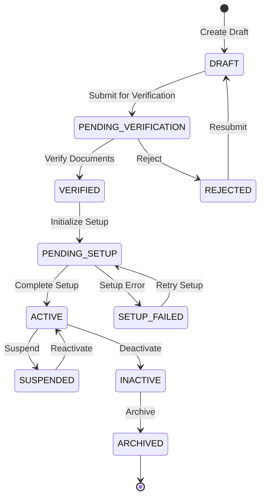

# FPO Lifecycle Management - Architecture Design

## Executive Summary

This document provides a comprehensive architecture design for FPO (Farmer Producer Organization) lifecycle management addressing the "failed to get FPO reference: no matching records found" error and establishing robust FPO management workflows.

## Problem Analysis

### Current Issue
- **Error**: "failed to get FPO reference: no matching records found"
- **Root Cause**: FPO references are not properly synchronized between AAA service and local database
- **Impact**: Breaks downstream operations requiring FPO context

### Key Findings
1. FPO creation workflow exists but lacks proper lifecycle management
2. No mechanism for FPO synchronization when references are missing
3. Incomplete error recovery for partial FPO setup failures
4. No FPO deactivation or suspension workflows

## Architecture Overview

### System Components

```
┌─────────────────────────────────────────────────────────────┐
│                     API Gateway Layer                        │
├─────────────────────────────────────────────────────────────┤
│                   FPO Lifecycle Handler                      │
│  - Create, Update, Activate, Deactivate, Suspend, Delete    │
├─────────────────────────────────────────────────────────────┤
│                   FPO Service Layer                          │
│  - Business Logic & State Machine                           │
│  - Validation & Authorization                               │
│  - Workflow Orchestration                                   │
├─────────────────────────────────────────────────────────────┤
│        FPO Repository        │        AAA Integration       │
│   BaseFilterableRepository   │      gRPC Client Layer       │
│      with FilterBuilder      │    Organization Management   │
├──────────────────────────────┴───────────────────────────────┤
│                    PostgreSQL Database                       │
│                      fpo_refs table                         │
│                   fpo_audit_logs table                      │
└─────────────────────────────────────────────────────────────┘
```

## FPO Lifecycle State Machine

### States



### State Definitions

| State | Description | Allowed Transitions | Business Rules |
|-------|-------------|-------------------|----------------|
| DRAFT | Initial FPO registration draft | PENDING_VERIFICATION | Can edit all fields |
| PENDING_VERIFICATION | Awaiting document verification | VERIFIED, REJECTED | Read-only state |
| VERIFIED | Documents verified, ready for setup | PENDING_SETUP | Can proceed to AAA setup |
| REJECTED | Verification failed | DRAFT | Must fix issues and resubmit |
| PENDING_SETUP | AAA setup in progress | ACTIVE, SETUP_FAILED | Partial setup tracking |
| SETUP_FAILED | AAA setup failed | PENDING_SETUP | Can retry with CompleteFPOSetup |
| ACTIVE | Fully operational FPO | SUSPENDED, INACTIVE | All operations allowed |
| SUSPENDED | Temporarily suspended | ACTIVE | Limited operations |
| INACTIVE | Permanently deactivated | ARCHIVED | No operations allowed |
| ARCHIVED | Historical record | None | Immutable state |

## Data Model Enhancements

### Enhanced FPORef Entity

```go
type FPORef struct {
    base.BaseModel

    // Core Fields
    AAAOrgID       string         `json:"aaa_org_id" gorm:"type:varchar(255);unique"`
    Name           string         `json:"name" gorm:"type:varchar(255);not null"`
    RegistrationNo string         `json:"registration_number" gorm:"type:varchar(255);unique"`

    // Lifecycle Fields
    Status         FPOStatus      `json:"status" gorm:"type:varchar(50);not null"`
    PreviousStatus FPOStatus      `json:"previous_status" gorm:"type:varchar(50)"`
    StatusReason   string         `json:"status_reason" gorm:"type:text"`
    StatusChangedAt time.Time     `json:"status_changed_at"`
    StatusChangedBy string        `json:"status_changed_by"`

    // Verification Fields
    VerificationStatus string      `json:"verification_status" gorm:"type:varchar(50)"`
    VerifiedAt        *time.Time   `json:"verified_at"`
    VerifiedBy        string       `json:"verified_by"`
    VerificationNotes string       `json:"verification_notes" gorm:"type:text"`

    // Setup Tracking
    SetupAttempts   int           `json:"setup_attempts" gorm:"default:0"`
    LastSetupAt     *time.Time    `json:"last_setup_at"`
    SetupErrors     entities.JSONB `json:"setup_errors" gorm:"type:jsonb"`
    SetupProgress   entities.JSONB `json:"setup_progress" gorm:"type:jsonb"`

    // Business Configuration
    BusinessConfig  entities.JSONB `json:"business_config" gorm:"type:jsonb;default:'{}'"`
    Metadata        entities.JSONB `json:"metadata" gorm:"type:jsonb;default:'{}'"`

    // Relationships
    CEOUserID       string        `json:"ceo_user_id" gorm:"type:varchar(255)"`
    ParentFPOID     *string       `json:"parent_fpo_id" gorm:"type:varchar(255)"`
}
```

### FPO Audit Log

```go
type FPOAuditLog struct {
    base.BaseModel

    FPOID          string         `json:"fpo_id" gorm:"type:varchar(255);not null;index"`
    Action         string         `json:"action" gorm:"type:varchar(100);not null"`
    PreviousState  FPOStatus      `json:"previous_state" gorm:"type:varchar(50)"`
    NewState       FPOStatus      `json:"new_state" gorm:"type:varchar(50)"`
    Reason         string         `json:"reason" gorm:"type:text"`
    PerformedBy    string         `json:"performed_by" gorm:"type:varchar(255);not null"`
    PerformedAt    time.Time      `json:"performed_at" gorm:"not null"`
    Details        entities.JSONB `json:"details" gorm:"type:jsonb"`
    RequestID      string         `json:"request_id" gorm:"type:varchar(255)"`
}
```

## Service Layer Design

### FPO Lifecycle Service Interface

```go
type FPOLifecycleService interface {
    // Creation & Registration
    CreateDraftFPO(ctx context.Context, req *CreateDraftFPORequest) (*FPORef, error)
    SubmitForVerification(ctx context.Context, fpoID string) error
    VerifyFPO(ctx context.Context, fpoID string, req *VerifyFPORequest) error
    RejectFPO(ctx context.Context, fpoID string, reason string) error

    // Setup & Activation
    InitializeFPOSetup(ctx context.Context, fpoID string) error
    CompleteFPOSetup(ctx context.Context, fpoID string) error
    RetryFailedSetup(ctx context.Context, fpoID string) error

    // State Management
    SuspendFPO(ctx context.Context, fpoID string, reason string) error
    ReactivateFPO(ctx context.Context, fpoID string) error
    DeactivateFPO(ctx context.Context, fpoID string, reason string) error
    ArchiveFPO(ctx context.Context, fpoID string) error

    // Synchronization
    SyncFPOFromAAA(ctx context.Context, aaaOrgID string) (*FPORef, error)
    ReconcileFPOReferences(ctx context.Context) error

    // Queries
    GetFPOByID(ctx context.Context, fpoID string) (*FPORef, error)
    GetFPOByAAAOrgID(ctx context.Context, aaaOrgID string) (*FPORef, error)
    ListFPOsByStatus(ctx context.Context, status FPOStatus, pagination *Pagination) ([]*FPORef, error)
    GetFPOHistory(ctx context.Context, fpoID string) ([]*FPOAuditLog, error)
}
```

### Repository Implementation

```go
type FPORepository struct {
    *base.BaseFilterableRepository[*fpo.FPORef]
    auditRepo *base.BaseFilterableRepository[*fpo.FPOAuditLog]
}

func NewFPORepository(dbManager interface{}) *FPORepository {
    repo := &FPORepository{
        BaseFilterableRepository: base.NewBaseFilterableRepository[*fpo.FPORef](),
        auditRepo: base.NewBaseFilterableRepository[*fpo.FPOAuditLog](),
    }
    repo.SetDBManager(dbManager)
    repo.auditRepo.SetDBManager(dbManager)
    return repo
}

// Extended methods
func (r *FPORepository) FindByAAAOrgID(ctx context.Context, aaaOrgID string) (*fpo.FPORef, error) {
    filter := base.NewFilterBuilder().
        Where("aaa_org_id", base.OpEqual, aaaOrgID).
        Build()
    return r.FindOne(ctx, filter)
}

func (r *FPORepository) UpdateStatus(ctx context.Context, fpoID string, newStatus fpo.FPOStatus, reason string, performedBy string) error {
    // Transaction with audit logging
    return r.Transaction(ctx, func(tx *gorm.DB) error {
        // Get current FPO
        var fpoRef fpo.FPORef
        if err := tx.First(&fpoRef, "id = ?", fpoID).Error; err != nil {
            return err
        }

        // Create audit log
        auditLog := &fpo.FPOAuditLog{
            FPOID:         fpoID,
            Action:        "STATUS_CHANGE",
            PreviousState: fpoRef.Status,
            NewState:      newStatus,
            Reason:        reason,
            PerformedBy:   performedBy,
            PerformedAt:   time.Now(),
        }

        // Update FPO status
        fpoRef.PreviousStatus = fpoRef.Status
        fpoRef.Status = newStatus
        fpoRef.StatusReason = reason
        fpoRef.StatusChangedAt = time.Now()
        fpoRef.StatusChangedBy = performedBy

        // Save both
        if err := tx.Save(&fpoRef).Error; err != nil {
            return err
        }
        return tx.Create(&auditLog).Error
    })
}
```

## Error Handling Strategy

### Error Recovery Mechanisms

1. **Missing FPO Reference Recovery**
```go
func (s *FPOLifecycleService) GetOrSyncFPO(ctx context.Context, aaaOrgID string) (*FPORef, error) {
    // Try local database first
    fpoRef, err := s.repo.FindByAAAOrgID(ctx, aaaOrgID)
    if err == nil && fpoRef != nil {
        return fpoRef, nil
    }

    // If not found, try to sync from AAA
    log.Printf("FPO reference not found locally for org %s, attempting sync from AAA", aaaOrgID)

    // Get organization from AAA
    org, err := s.aaaService.GetOrganization(ctx, aaaOrgID)
    if err != nil {
        return nil, fmt.Errorf("failed to get FPO from AAA: %w", err)
    }

    // Create local reference
    fpoRef = &FPORef{
        AAAOrgID: aaaOrgID,
        Name:     org.Name,
        Status:   FPOStatusActive, // Assume active if exists in AAA
        Metadata: org.Metadata,
    }

    if err := s.repo.Create(ctx, fpoRef); err != nil {
        return nil, fmt.Errorf("failed to create local FPO reference: %w", err)
    }

    log.Printf("Successfully synchronized FPO %s from AAA", fpoRef.ID)
    return fpoRef, nil
}
```

2. **Setup Failure Recovery**
```go
func (s *FPOLifecycleService) RetryFailedSetup(ctx context.Context, fpoID string) error {
    fpoRef, err := s.repo.FindByID(ctx, fpoID)
    if err != nil {
        return err
    }

    if fpoRef.Status != FPOStatusSetupFailed {
        return fmt.Errorf("FPO is not in SETUP_FAILED status")
    }

    // Increment retry attempt
    fpoRef.SetupAttempts++
    if fpoRef.SetupAttempts > MaxSetupRetries {
        return fmt.Errorf("maximum setup retries exceeded")
    }

    // Clear previous errors
    setupErrors := make(map[string]interface{})

    // Retry each failed component
    if err := s.retryUserGroups(ctx, fpoRef, setupErrors); err != nil {
        log.Printf("User group setup still failing: %v", err)
    }

    if err := s.retryPermissions(ctx, fpoRef, setupErrors); err != nil {
        log.Printf("Permission setup still failing: %v", err)
    }

    // Update status based on results
    if len(setupErrors) == 0 {
        fpoRef.Status = FPOStatusActive
        fpoRef.SetupErrors = nil
    } else {
        fpoRef.SetupErrors = setupErrors
    }

    fpoRef.LastSetupAt = &time.Now()
    return s.repo.Update(ctx, fpoRef)
}
```

## API Endpoints

### FPO Lifecycle Management APIs

| Method | Endpoint | Description | Status Transitions |
|--------|----------|-------------|-------------------|
| POST | `/api/v1/fpo/draft` | Create draft FPO | → DRAFT |
| POST | `/api/v1/fpo/{id}/submit` | Submit for verification | DRAFT → PENDING_VERIFICATION |
| POST | `/api/v1/fpo/{id}/verify` | Verify FPO | PENDING_VERIFICATION → VERIFIED |
| POST | `/api/v1/fpo/{id}/reject` | Reject FPO | PENDING_VERIFICATION → REJECTED |
| POST | `/api/v1/fpo/{id}/setup` | Initialize setup | VERIFIED → PENDING_SETUP |
| POST | `/api/v1/fpo/{id}/complete-setup` | Complete setup | PENDING_SETUP → ACTIVE |
| POST | `/api/v1/fpo/{id}/retry-setup` | Retry failed setup | SETUP_FAILED → PENDING_SETUP |
| PUT | `/api/v1/fpo/{id}/suspend` | Suspend FPO | ACTIVE → SUSPENDED |
| PUT | `/api/v1/fpo/{id}/reactivate` | Reactivate FPO | SUSPENDED → ACTIVE |
| DELETE | `/api/v1/fpo/{id}/deactivate` | Deactivate FPO | ACTIVE → INACTIVE |
| POST | `/api/v1/fpo/{id}/archive` | Archive FPO | INACTIVE → ARCHIVED |
| POST | `/api/v1/fpo/sync/{aaa_org_id}` | Sync from AAA | Creates local reference |
| GET | `/api/v1/fpo/{id}` | Get FPO details | - |
| GET | `/api/v1/fpo/by-org/{aaa_org_id}` | Get by AAA org ID | - |
| GET | `/api/v1/fpo/{id}/history` | Get FPO history | - |
| GET | `/api/v1/fpo/list` | List FPOs | - |

## Security Considerations

### Authorization Matrix

| Operation | Required Permissions | Additional Checks |
|-----------|---------------------|------------------|
| Create Draft | `fpo:create` | - |
| Submit Verification | `fpo:submit` | Must be draft owner or admin |
| Verify FPO | `fpo:verify` | Verifier role required |
| Setup FPO | `fpo:setup` | System admin only |
| Suspend FPO | `fpo:suspend` | Admin with reason required |
| Deactivate FPO | `fpo:deactivate` | Super admin only |
| Sync FPO | `fpo:sync` | System or admin |

### Data Validation

1. **Input Validation**
   - Registration number format validation
   - Phone number validation with country code
   - Email format validation
   - Required field checks

2. **Business Rule Validation**
   - CEO uniqueness across FPOs
   - State transition rules
   - Retry limits
   - Document verification requirements

## Performance Optimization

### Caching Strategy

```go
type FPOCache interface {
    Get(ctx context.Context, key string) (*FPORef, error)
    Set(ctx context.Context, key string, value *FPORef, ttl time.Duration) error
    Delete(ctx context.Context, key string) error
}

// Cache keys
func fpoIDCacheKey(id string) string {
    return fmt.Sprintf("fpo:id:%s", id)
}

func fpoOrgIDCacheKey(orgID string) string {
    return fmt.Sprintf("fpo:org:%s", orgID)
}
```

### Database Indexes

```sql
-- Performance indexes
CREATE INDEX idx_fpo_refs_status ON fpo_refs(status) WHERE deleted_at IS NULL;
CREATE INDEX idx_fpo_refs_aaa_org_id ON fpo_refs(aaa_org_id) WHERE deleted_at IS NULL;
CREATE INDEX idx_fpo_refs_registration_no ON fpo_refs(registration_number) WHERE deleted_at IS NULL;
CREATE INDEX idx_fpo_refs_ceo_user_id ON fpo_refs(ceo_user_id) WHERE deleted_at IS NULL;

-- Audit log indexes
CREATE INDEX idx_fpo_audit_logs_fpo_id ON fpo_audit_logs(fpo_id);
CREATE INDEX idx_fpo_audit_logs_performed_at ON fpo_audit_logs(performed_at DESC);
CREATE INDEX idx_fpo_audit_logs_action ON fpo_audit_logs(action);
```

## Monitoring & Observability

### Key Metrics

```go
// Prometheus metrics
var (
    fpoCreationTotal = prometheus.NewCounterVec(
        prometheus.CounterOpts{
            Name: "fpo_creation_total",
            Help: "Total number of FPO creation attempts",
        },
        []string{"status"},
    )

    fpoStateTransitions = prometheus.NewCounterVec(
        prometheus.CounterOpts{
            Name: "fpo_state_transitions_total",
            Help: "Total number of FPO state transitions",
        },
        []string{"from_state", "to_state"},
    )

    fpoSetupRetries = prometheus.NewHistogram(
        prometheus.HistogramOpts{
            Name:    "fpo_setup_retries",
            Help:    "Number of setup retries per FPO",
            Buckets: []float64{0, 1, 2, 3, 5, 10},
        },
    )

    fpoSyncLatency = prometheus.NewHistogram(
        prometheus.HistogramOpts{
            Name:    "fpo_sync_latency_seconds",
            Help:    "Latency of FPO synchronization from AAA",
            Buckets: prometheus.DefBuckets,
        },
    )
)
```

### Logging Strategy

```go
// Structured logging for lifecycle events
func (s *FPOLifecycleService) logStateTransition(ctx context.Context, fpo *FPORef, newState FPOStatus, reason string) {
    s.logger.Info("FPO state transition",
        zap.String("fpo_id", fpo.ID),
        zap.String("aaa_org_id", fpo.AAAOrgID),
        zap.String("from_state", fpo.Status.String()),
        zap.String("to_state", newState.String()),
        zap.String("reason", reason),
        zap.String("request_id", GetRequestID(ctx)),
        zap.String("user_id", GetUserID(ctx)),
    )
}
```

## Migration Strategy

### Database Migration

```sql
-- Add new columns to existing fpo_refs table
ALTER TABLE fpo_refs ADD COLUMN previous_status VARCHAR(50);
ALTER TABLE fpo_refs ADD COLUMN status_reason TEXT;
ALTER TABLE fpo_refs ADD COLUMN status_changed_at TIMESTAMP;
ALTER TABLE fpo_refs ADD COLUMN status_changed_by VARCHAR(255);
ALTER TABLE fpo_refs ADD COLUMN verification_status VARCHAR(50);
ALTER TABLE fpo_refs ADD COLUMN verified_at TIMESTAMP;
ALTER TABLE fpo_refs ADD COLUMN verified_by VARCHAR(255);
ALTER TABLE fpo_refs ADD COLUMN verification_notes TEXT;
ALTER TABLE fpo_refs ADD COLUMN setup_attempts INT DEFAULT 0;
ALTER TABLE fpo_refs ADD COLUMN last_setup_at TIMESTAMP;
ALTER TABLE fpo_refs ADD COLUMN setup_progress JSONB DEFAULT '{}';
ALTER TABLE fpo_refs ADD COLUMN ceo_user_id VARCHAR(255);
ALTER TABLE fpo_refs ADD COLUMN parent_fpo_id VARCHAR(255);

-- Create audit log table
CREATE TABLE fpo_audit_logs (
    id VARCHAR(255) PRIMARY KEY,
    fpo_id VARCHAR(255) NOT NULL,
    action VARCHAR(100) NOT NULL,
    previous_state VARCHAR(50),
    new_state VARCHAR(50),
    reason TEXT,
    performed_by VARCHAR(255) NOT NULL,
    performed_at TIMESTAMP NOT NULL,
    details JSONB,
    request_id VARCHAR(255),
    created_at TIMESTAMP DEFAULT CURRENT_TIMESTAMP,
    updated_at TIMESTAMP DEFAULT CURRENT_TIMESTAMP,
    deleted_at TIMESTAMP,
    FOREIGN KEY (fpo_id) REFERENCES fpo_refs(id)
);

-- Update existing FPOs to new status model
UPDATE fpo_refs
SET status = 'ACTIVE'
WHERE status = 'ACTIVE';

UPDATE fpo_refs
SET status = 'SETUP_FAILED',
    status_reason = 'Legacy pending setup status'
WHERE status = 'PENDING_SETUP';
```

## Testing Strategy

### Unit Tests

```go
func TestFPOLifecycle(t *testing.T) {
    tests := []struct {
        name           string
        initialState   FPOStatus
        action         string
        expectedState  FPOStatus
        shouldError    bool
    }{
        {
            name:          "Draft to Pending Verification",
            initialState:  FPOStatusDraft,
            action:        "submit",
            expectedState: FPOStatusPendingVerification,
            shouldError:   false,
        },
        {
            name:          "Active to Suspended",
            initialState:  FPOStatusActive,
            action:        "suspend",
            expectedState: FPOStatusSuspended,
            shouldError:   false,
        },
        {
            name:          "Invalid transition",
            initialState:  FPOStatusArchived,
            action:        "activate",
            expectedState: FPOStatusArchived,
            shouldError:   true,
        },
    }

    for _, tt := range tests {
        t.Run(tt.name, func(t *testing.T) {
            // Test implementation
        })
    }
}
```

### Integration Tests

```go
func TestFPOSyncFromAAA(t *testing.T) {
    // Setup mock AAA service
    mockAAA := NewMockAAAService()
    mockAAA.On("GetOrganization", "org_123").Return(&Organization{
        ID:   "org_123",
        Name: "Test FPO",
    }, nil)

    // Test sync
    service := NewFPOLifecycleService(repo, mockAAA)
    fpo, err := service.SyncFPOFromAAA(ctx, "org_123")

    assert.NoError(t, err)
    assert.Equal(t, "org_123", fpo.AAAOrgID)
    assert.Equal(t, "Test FPO", fpo.Name)
    assert.Equal(t, FPOStatusActive, fpo.Status)
}
```

## Rollback Plan

1. **Database Rollback**
   - Keep backup of fpo_refs table before migration
   - Prepare rollback script to remove new columns
   - Test rollback in staging environment

2. **Code Rollback**
   - Use feature flags for new lifecycle endpoints
   - Maintain backward compatibility for existing endpoints
   - Gradual rollout with monitoring

3. **AAA Service Rollback**
   - Ensure AAA changes are backward compatible
   - Version API endpoints if breaking changes needed

## Success Criteria

1. **Functional Requirements**
   - All FPO lifecycle states implemented
   - State transitions working correctly
   - Audit logging for all changes
   - Sync from AAA functioning

2. **Non-Functional Requirements**
   - API response time < 500ms for read operations
   - API response time < 2s for write operations
   - 99.9% availability
   - Zero data loss for state transitions

3. **Quality Metrics**
   - Test coverage > 80%
   - No critical security vulnerabilities
   - All endpoints documented in Swagger
   - Monitoring dashboards created

## References

- [FPO AAA Integration Documentation](./../fpo-aaa-integration/README.md)
- [BaseFilterableRepository Documentation](https://github.com/Kisanlink/kisanlink-db)
- [OWASP ASVS v4.0](https://owasp.org/www-project-application-security-verification-standard/)
- [PostgreSQL JSONB Best Practices](https://www.postgresql.org/docs/current/datatype-json.html)
