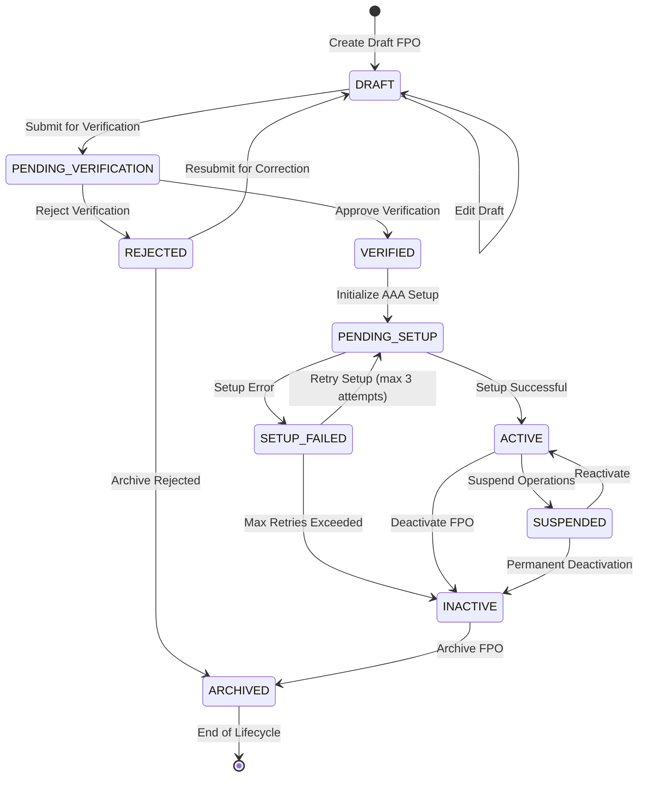

# FPO Lifecycle State Diagram

## State Transition Diagram



## State Definitions

### DRAFT
- **Description**: Initial FPO registration, all data can be edited
- **Entry Actions**: Create FPO record with minimal validation
- **Exit Actions**: Validate all required fields are complete
- **Allowed Operations**: Edit all fields, delete draft
- **Transitions To**: PENDING_VERIFICATION

### PENDING_VERIFICATION
- **Description**: FPO submitted for document and compliance verification
- **Entry Actions**: Send notification to verifiers, log submission
- **Exit Actions**: Record verification result and notes
- **Allowed Operations**: View only, add verification notes
- **Transitions To**: VERIFIED, REJECTED

### VERIFIED
- **Description**: FPO documents verified, ready for system setup
- **Entry Actions**: Mark verification timestamp, notify FPO admin
- **Exit Actions**: Prepare for AAA integration
- **Allowed Operations**: View verified data, initiate setup
- **Transitions To**: PENDING_SETUP

### REJECTED
- **Description**: Verification failed, corrections needed
- **Entry Actions**: Record rejection reason, notify submitter
- **Exit Actions**: Clear rejection status
- **Allowed Operations**: View rejection notes, edit and resubmit
- **Transitions To**: DRAFT, ARCHIVED

### PENDING_SETUP
- **Description**: AAA organization and user setup in progress
- **Entry Actions**: Trigger AAA API calls, track setup progress
- **Exit Actions**: Record setup result
- **Allowed Operations**: Monitor setup progress, retry failed components
- **Transitions To**: ACTIVE, SETUP_FAILED

### SETUP_FAILED
- **Description**: AAA setup encountered errors
- **Entry Actions**: Log setup errors, increment retry counter
- **Exit Actions**: Clear error state if retrying
- **Allowed Operations**: View error details, retry setup
- **Transitions To**: PENDING_SETUP (retry), INACTIVE (max retries)

### ACTIVE
- **Description**: Fully operational FPO
- **Entry Actions**: Enable all FPO features, notify stakeholders
- **Exit Actions**: Disable active operations
- **Allowed Operations**: All FPO operations enabled
- **Transitions To**: SUSPENDED, INACTIVE

### SUSPENDED
- **Description**: Temporarily suspended due to compliance or other issues
- **Entry Actions**: Disable write operations, log suspension reason
- **Exit Actions**: Clear suspension flags
- **Allowed Operations**: Read-only access, admin operations
- **Transitions To**: ACTIVE, INACTIVE

### INACTIVE
- **Description**: Permanently deactivated FPO
- **Entry Actions**: Disable all operations, archive active data
- **Exit Actions**: Prepare for archival
- **Allowed Operations**: Read-only historical access
- **Transitions To**: ARCHIVED

### ARCHIVED
- **Description**: Historical record, immutable state
- **Entry Actions**: Move to cold storage, create archive record
- **Exit Actions**: None (terminal state)
- **Allowed Operations**: Historical queries only
- **Transitions To**: None (terminal state)

## Transition Rules

### Valid Transitions Matrix

| From State | To State | Condition | Required Permission |
|------------|----------|-----------|-------------------|
| DRAFT | PENDING_VERIFICATION | All required fields complete | `fpo:submit` |
| PENDING_VERIFICATION | VERIFIED | Documents approved | `fpo:verify` |
| PENDING_VERIFICATION | REJECTED | Documents rejected | `fpo:verify` |
| REJECTED | DRAFT | Resubmission requested | `fpo:edit` |
| REJECTED | ARCHIVED | No further action needed | `fpo:archive` |
| VERIFIED | PENDING_SETUP | Setup initiated | `fpo:setup` |
| PENDING_SETUP | ACTIVE | All components setup | System |
| PENDING_SETUP | SETUP_FAILED | Setup errors occurred | System |
| SETUP_FAILED | PENDING_SETUP | Retry requested & attempts < 3 | `fpo:setup` |
| SETUP_FAILED | INACTIVE | Max retries exceeded | System |
| ACTIVE | SUSPENDED | Compliance issue | `fpo:suspend` |
| ACTIVE | INACTIVE | Deactivation requested | `fpo:deactivate` |
| SUSPENDED | ACTIVE | Issue resolved | `fpo:reactivate` |
| SUSPENDED | INACTIVE | Permanent deactivation | `fpo:deactivate` |
| INACTIVE | ARCHIVED | Archival requested | `fpo:archive` |

## Business Rules for Transitions

### Submission Rules (DRAFT → PENDING_VERIFICATION)
1. All mandatory fields must be populated
2. Registration number must be unique
3. CEO user details must be complete
4. Business configuration must be valid JSON

### Verification Rules (PENDING_VERIFICATION → VERIFIED/REJECTED)
1. Only authorized verifiers can approve/reject
2. Rejection must include reason
3. Verification notes are mandatory
4. Cannot verify own FPO submission

### Setup Rules (PENDING_SETUP → ACTIVE/SETUP_FAILED)
1. Maximum 3 retry attempts allowed
2. Each retry increments attempt counter
3. Setup errors must be logged with details
4. Partial success tracked in setup_progress

### Suspension Rules (ACTIVE → SUSPENDED)
1. Suspension reason is mandatory
2. Must notify all active users
3. Active transactions must be handled gracefully
4. Audit log entry required

### Deactivation Rules (→ INACTIVE)
1. Requires admin approval
2. Must check for pending transactions
3. Data retention policy applies
4. Cannot be reversed once archived

## State Persistence

### Database Fields

```sql
-- Core state fields
status VARCHAR(50) NOT NULL DEFAULT 'DRAFT',
previous_status VARCHAR(50),
status_changed_at TIMESTAMP,
status_changed_by VARCHAR(255),
status_reason TEXT,

-- Verification tracking
verification_status VARCHAR(50),
verified_at TIMESTAMP,
verified_by VARCHAR(255),
verification_notes TEXT,

-- Setup tracking
setup_attempts INT DEFAULT 0,
last_setup_at TIMESTAMP,
setup_errors JSONB,
setup_progress JSONB,

-- Suspension tracking
suspended_at TIMESTAMP,
suspended_by VARCHAR(255),
suspension_reason TEXT,
suspension_lifted_at TIMESTAMP,

-- Archival tracking
archived_at TIMESTAMP,
archived_by VARCHAR(255),
archive_location VARCHAR(255)
```

## Event Notifications

### State Change Events

Each state transition triggers events for:
1. **Audit Logging**: Record in fpo_audit_logs table
2. **Notifications**: Send to relevant stakeholders
3. **Metrics**: Update monitoring metrics
4. **Webhooks**: Trigger external integrations

### Event Structure

```json
{
  "event_type": "fpo_state_changed",
  "timestamp": "2025-11-18T10:00:00Z",
  "fpo_id": "FPOR_1234567890",
  "transition": {
    "from_state": "DRAFT",
    "to_state": "PENDING_VERIFICATION",
    "reason": "Submitted for verification",
    "performed_by": "user_123",
    "metadata": {
      "ip_address": "192.168.1.1",
      "user_agent": "Mozilla/5.0...",
      "request_id": "req_abc123"
    }
  }
}
```

## Error Handling in Transitions

### Transition Failures

When a transition fails:
1. State remains unchanged
2. Error is logged with details
3. User receives clear error message
4. Retry mechanism activated (where applicable)

### Recovery Mechanisms

1. **Automatic Retry**: For system-initiated transitions
2. **Manual Retry**: For user-initiated transitions
3. **Rollback**: Revert to previous state if critical
4. **Escalation**: Alert admins for manual intervention

## Monitoring & Metrics

### Key Metrics to Track

```prometheus
# State distribution
fpo_state_count{state="ACTIVE"} 150
fpo_state_count{state="DRAFT"} 23
fpo_state_count{state="SUSPENDED"} 5

# Transition success/failure
fpo_transitions_total{from="DRAFT", to="PENDING_VERIFICATION", result="success"} 234
fpo_transitions_total{from="PENDING_SETUP", to="ACTIVE", result="failure"} 12

# Time in state
fpo_time_in_state_seconds{state="PENDING_VERIFICATION", quantile="0.95"} 86400

# Setup retry attempts
fpo_setup_retries{attempt="1"} 45
fpo_setup_retries{attempt="2"} 12
fpo_setup_retries{attempt="3"} 3
```

### Alerting Rules

1. **Stuck in PENDING_VERIFICATION > 48 hours**: Alert verifiers
2. **SETUP_FAILED with max retries**: Alert admin team
3. **High rejection rate (> 30%)**: Review verification criteria
4. **Multiple SUSPENDED FPOs**: Investigate systemic issue

## Implementation Checklist

- [ ] Define all state constants in code
- [ ] Implement state transition validation
- [ ] Create audit logging for each transition
- [ ] Add database indexes for state queries
- [ ] Implement notification system
- [ ] Create monitoring dashboards
- [ ] Write comprehensive tests for all transitions
- [ ] Document state-specific business logic
- [ ] Configure alerts for critical states
- [ ] Implement state recovery mechanisms
