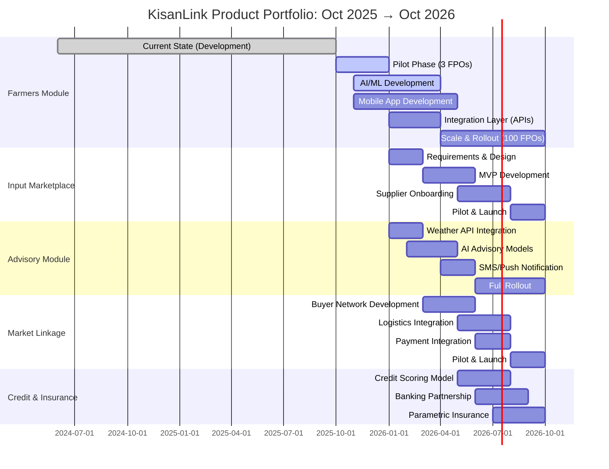
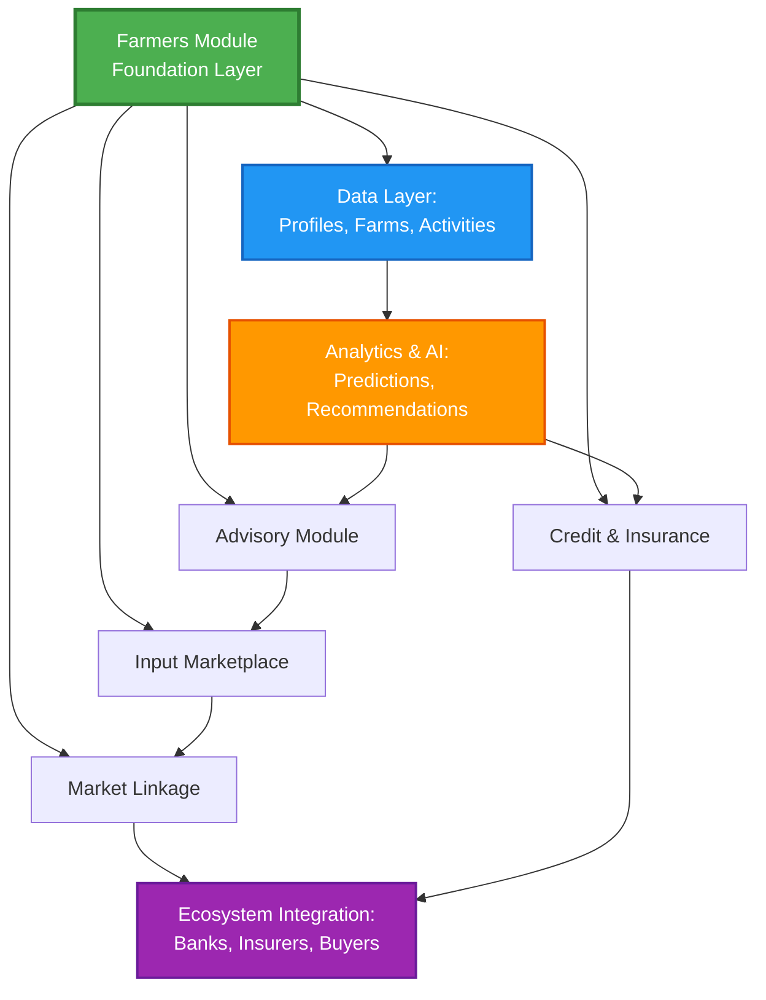

# KisanLink Farmers Module - Product Portfolio

## Document Overview

This document provides a comprehensive view of the Farmers Module product within the KisanLink ecosystem, including current state, future roadmap, real-world impact projections, and comparative analysis with other potential modules in the portfolio.

**Last Updated**: October 2025
**Document Owner**: Product & Engineering Team
**Version**: 1.0

---

## 1. Purpose & Vision

### What this product solves in the real world

#### Core Problem Statement

Most small and marginal farmers in India lack organized digital records, insights, and linkage to input/credit/markets. Agricultural decisions are often reactive, manual record-keeping is error-prone, and access to finance, insurance, and input optimization is limited. Traditional extension services are under-resourced and disconnected from farmer realities.

The result: yield losses, input inefficiencies, lack of price discovery, and limited access to financial services.

#### Target Beneficiaries

- **Smallholder farmers** (especially with ≤ 5 ha) who need digital farm records and access to services
- **Field agents / extension workers** (Kisan Sathis) who serve multiple farmers
- **FPOs** (Farmer Producer Organisations) that manage communities of farmers
- **Agri-businesses** seeking traceable supply chains and reliable farmer data
- **Financial institutions** needing creditworthiness data for farmer lending

#### Value Proposition

A unified digital platform providing:

1. **Digital Farm Ledger**: Complete farmer profiles, farm parcels with spatial boundaries, activity logs, and crop cycle tracking
2. **Traceability**: Full chain visibility from farm to buyer for all produce logged in the system
3. **Data-Driven Insights**: Analytics on farm performance, crop patterns, and resource utilization
4. **Service Linkage**: Interface for FPOs to manage their farmer network and connect to input, credit, insurance, and market services
5. **Workflow Automation**: 19 pre-defined workflows (W1-W19) covering identity management, farm operations, crop management, and access control

#### Long-Term Vision

Become the canonical digital layer of farm-level data in India, powering:
- Credit scoring and financial inclusion
- Parametric insurance products
- Precision input recommendations
- Traceable supply chains
- Marketplace linkages across the ecosystem
- Climate-smart agriculture practices

---

## 2. Current State (As of October 2025)

### Technical Readiness

#### Features Built & Deployed

**Core Domain Entities**:
- **Farmer Management**: Complete profile management, FPO linkage, Kisan Sathi assignment
- **Farm Management**: Spatial farm boundaries using PostGIS, farm attributes, area calculations
- **Crop Cycle Management**: Seasonal cycle tracking (Rabi, Kharif, Zaid), crop type management, yield tracking (including perennial crops)
- **Farm Activity Management**: Activity logging, completion tracking, stage-based workflows
- **FPO Management**: Organization references, farmer-FPO linkages

**Operational Capabilities**:
- **Bulk Operations**: CSV import/export for farmer data, farm data, crop cycles
- **Spatial Operations**: PostGIS integration for geographic queries, boundary validation, area calculations
- **Data Quality**: Validation rules, data completeness checks, integrity constraints
- **Reporting**: Aggregation dashboards (area distribution, crop mix, cycle status)
- **Lookup Services**: Master data management for crops, activities, reference data

**Security & Access Control**:
- **AAA Integration**: Delegated authentication and authorization via AAA service
- **Role-Based Access Control**: Permission checks on all operations
- **Audit Logging**: Structured audit trail for all operations
- **Organization Isolation**: Multi-tenant architecture with organization-level data segregation

#### Modules Live

| Module | Status | Description |
|--------|--------|-------------|
| Farmers Module | ✅ Production | Complete farmer profile and linkage management |
| Farms / Parcel Module | ✅ Production | Spatial farm boundaries with PostGIS |
| Crop Cycle Module | ✅ Production | Seasonal cycle tracking with yield management |
| Farm Activities Module | ✅ Production | Activity logging and completion tracking |
| Bulk Operations Module | ✅ Production | CSV import/export for all entities |
| Reporting Module | ✅ Production | Aggregation and analytics |
| Admin Module | ✅ Production | System administration and configuration |
| Stage Management | ✅ Production | Workflow stage tracking |

#### Integrations Done

- **AAA Service**: gRPC-based authentication and authorization
- **PostGIS**: Spatial database for geographic operations
- **gRPC + HTTP Gateway**: Dual protocol support for API access
- **Swagger/OpenAPI**: Auto-generated API documentation
- **Structured Logging**: Uber Zap for observability

#### Technical Architecture

**Technology Stack**:
- **Language**: Go 1.24+ with modern toolchain
- **Database**: PostgreSQL 16+ with PostGIS extension
- **API Protocols**: gRPC (internal), HTTP REST (external) via grpc-gateway
- **Web Framework**: Gin for HTTP routing
- **ORM**: GORM with custom repository patterns (kisanlink-db)
- **Configuration**: Environment-based with godotenv
- **Logging**: Uber Zap structured logging

**Architecture Pattern**: Clean Architecture with:
1. **Transport Layer**: HTTP handlers, gRPC servers, middleware
2. **Service Layer**: Business logic, workflow orchestration (19 workflows)
3. **Repository Layer**: Data access using kisanlink-db BaseFilterableRepository
4. **Domain Layer**: Core entities, business rules

**Codebase Metrics**:
- **Go Files**: 182
- **Lines of Code**: ~44,364
- **Test Coverage**: Growing test suite with unit and integration tests
- **Workflows Defined**: 19 (W1-W19)

#### Pilots Running

**Status**: Development/Testing Phase
- **Target Pilot**: 3 FPOs in 3 states
- **Farmer Coverage**: Planning for ~500 farmers in pilot
- **Field Staff**: ~50 field agents / Kisan Sathis planned
- **Duration**: 6-month pilot planned

#### Current Users

**Development Phase** (pre-pilot):
- Internal testing team: ~10 users
- Development stakeholders: 5 users
- **Target Pilot Users**: 500+ farmers, 50+ agents, 3 FPO stakeholders

### Data Capabilities

#### Data Sources

1. **Manual Entry**: Field agents enter farmer and farm data
2. **CSV Uploads**: Bulk import of farmer records, farm boundaries, crop cycles
3. **GPS/Spatial**: Map-based drawing of farm parcels with coordinate capture
4. **System-Generated**: Automatic calculations (areas, aggregations, counters)

#### Analytics & Reporting

**Current Capabilities**:
- Farm area aggregation by FPO, farmer, crop type
- Crop distribution analysis (area by crop)
- Crop cycle status tracking
- Yield tracking (annual and perennial crops)
- Data quality metrics and completeness reports
- Activity completion rates

**Dashboard Views**:
- FPO-level aggregations
- Farmer portfolio views
- Farm boundary visualizations
- Crop cycle timeline views

#### AI/ML

**Status**: Not yet deployed in production

**Planned Capabilities**:
- Yield prediction models
- Pest/disease detection from images
- Anomaly detection in farm activities
- Input recommendation engine

---

## 3. Expected State (6–12 Months: April–October 2026)

### New Capabilities

#### New Modules (Planned)

| Module | Description | Timeline |
|--------|-------------|----------|
| **Weather & Advisory** | Real-time weather data + forecast integration, location-based advisories | Q2 2026 |
| **Soil Health** | Lab results ingestion, soil parameter tracking, recommendations | Q2 2026 |
| **Input Recommendation Engine** | AI-driven fertilizer, pesticide, seed recommendations | Q3 2026 |
| **Mobile App** | Farmer-facing mobile app with vernacular support | Q2-Q3 2026 |
| **Market Linkage** | Produce sale tracking, buyer matching, price discovery | Q3 2026 |
| **Alerts & Notifications** | SMS, push notifications for weather, advisories, activities | Q2 2026 |
| **Satellite Imagery Integration** | NDVI, crop health monitoring, boundary verification | Q3 2026 |
| **IoT Sensor Integration** | Soil moisture, pH, weather station data ingestion | Q4 2026 |

#### Data Pipelines (Planned)

1. **Satellite Imagery**: Sentinel-2, Planet Labs integration for crop health monitoring
2. **Weather APIs**: IMD, OpenWeather, or private weather data providers
3. **Soil Lab Networks**: Integration with state soil testing labs
4. **Market Price Feeds**: Mandi price APIs, AGMARKNET integration
5. **IoT Device Networks**: Sensor data ingestion via MQTT/HTTP

#### Partnerships (Planned)

- **State Agriculture Departments**: Soil health cards, extension services, scheme linkage
- **Agritech Companies**: Input suppliers, equipment rental services
- **Agri-Fintech**: Credit scoring, loan origination, insurance providers
- **Data Providers**: Satellite imagery, weather data, market intelligence
- **Research Institutions**: Agronomic models, variety recommendations

#### AI Capabilities (Planned)

**Yield Prediction**:
- Historical yield analysis
- Weather pattern correlation
- Soil parameter integration
- Crop variety-specific models

**Pest & Disease Detection**:
- Image-based identification
- Early warning systems
- Treatment recommendations
- Spread prediction models

**Personalized Recommendations**:
- Input optimization (fertilizer, pesticide, water)
- Crop variety selection based on local conditions
- Planting date recommendations
- Market timing suggestions

**Anomaly Detection**:
- Unusual activity patterns
- Potential data quality issues
- Risk indicators (weather, pest, market)
- Advisory triggers

#### Market Rollout

**Geographic Expansion**:
- **Phase 1 (Q1-Q2 2026)**: 8-10 new states
- **Phase 2 (Q3-Q4 2026)**: 20+ districts across states
- **Coverage**: Focus on major agricultural belts

**FPO Onboarding**:
- **Target**: 50-100 additional FPOs by Q4 2026
- **Verticals**: Cereals, pulses, horticulture, dairy, organic
- **Size Range**: 100-5000 farmer members per FPO

### Scale Targets (October 2026)

#### User Growth

| User Type | Current | Target (Oct 2026) | Growth |
|-----------|---------|-------------------|--------|
| Farmers | ~500 (pilot) | 30,000 | 60x |
| Field Agents / Kisan Sathis | ~50 (pilot) | 500 | 10x |
| FPOs | 3 (pilot) | 100 | 33x |
| Admin/Support Staff | 10 | 50 | 5x |

#### Transaction Volumes

- **Farm Activities Logged**: 200,000 annually
- **Alerts/Recommendations Served**: 50,000+ per season
- **Crop Cycles Tracked**: 40,000-50,000 per year
- **API Requests**: 1M+ per month

#### Geographic Coverage

- **States**: 8-10 states (from initial 3)
- **Districts**: 20+ districts
- **Villages**: 500+ villages
- **Farm Parcels**: 35,000-40,000 mapped

---

## 4. Real-World Impact

### Economic Impact

#### Who Earns / Saves More

**Farmers** (Direct Beneficiaries):
- **Yield Uplift**: 10-15% through advisory, optimized input timing, and better crop management
  - *Mechanism*: Data-driven advisories, timely alerts, input recommendations
  - *Example*: Farmer with 2 ha producing 4 tons/ha wheat → 4.4-4.6 tons/ha = +0.8-1.2 tons at ₹2,500/ton = ₹2,000-₹3,000 per ha
- **Cost Reduction**: 8-12% via recommendation engine and input optimization
  - *Mechanism*: Precision application, reduced wastage, better input sourcing
  - *Example*: Typical input cost ₹20,000/ha → save ₹1,600-₹2,400/ha
- **Better Price Realization**: 5-10% via traceability and market access
  - *Mechanism*: Quality assurance, direct buyer linkage, reduced intermediaries
  - *Example*: ₹2,500/quintal → ₹2,625-₹2,750/quintal
- **Net Benefit per Farmer**: ₹5,000-₹8,000 per year on average

**FPOs** (Organizing Entities):
- **Operational Efficiency**: 20-30% reduction in administrative overhead
  - *Mechanism*: Automated reporting, digital records, reduced manual errors
- **Value Addition**: Premium for traceable, quality-assured produce (3-5%)
- **New Revenue Streams**: Service fees, commission on inputs/marketplace
  - *Model*: ₹200-₹500 per farmer per year subscription
- **Procurement Efficiency**: Better demand forecasting, aggregation benefits
- **Net Benefit per FPO**: ₹2-5 lakh per year (depending on size)

**Collaborators / Partners**:
- **Input Firms**: Better targeting, demand forecasting, reduced distribution costs
- **Insurers**: Improved risk modeling, reduced loss ratios, faster claim processing
- **Financiers**: Better credit assessment, reduced default rates, expanded TAM
- **Buyers/Processors**: Assured quality, traceability, consistent supply

#### Total Value Created

**Year 1 (Full Scale - Oct 2026)**:
- **Farmers**: 30,000 farmers × ₹5,000 average benefit = **₹15 crore (₹150 million)**
- **FPOs**: 100 FPOs × ₹3 lakh average benefit = **₹3 crore (₹30 million)**
- **Ecosystem**: Input efficiency, reduced credit risk, insurance savings = **₹5 crore (₹50 million)** estimated
- **Total Economic Value**: **₹23 crore (₹230 million)** per year

**Year 3 Projection (2028)**:
- **Farmers**: 100,000 farmers × ₹6,000 = **₹60 crore**
- **Total Ecosystem Value**: **₹100+ crore** annually

### Social Impact

#### Digital Literacy & Capacity Building

**Farmer Training**:
- **Target**: 30,000 farmers trained on mobile app usage
- **Vernacular UI**: Support for Hindi, Telugu, Tamil, Kannada, Marathi, Bengali
- **Training Mode**: In-person (Kisan Sathis), video tutorials, helpdesk
- **Topics**: App navigation, farm data entry, reading advisories, marketplace usage

**Field Agent Capacity**:
- **Training**: 500 field agents on system usage, data quality, extension services
- **Certification**: Kisan Sathi certification program
- **Tools**: Equipped with smartphones, data plans, field kits

#### Women Participation

**Targets**:
- **Farmer Users**: ≥30% women (≈9,000 women farmers)
- **Field Agents**: ≥40% women Kisan Sathis (≈200 women agents)

**Initiatives**:
- Women-focused FPOs prioritized in onboarding
- Women-specific training sessions and support
- Vernacular content and accessibility features
- Success story documentation and promotion

#### Employment Creation

**Direct Employment**:
- **Kisan Sathis**: 100+ new field agent roles
- **Implementation Team**: 20-30 roles (trainers, support, coordinators)
- **Operations**: 10-15 roles (data quality, helpdesk, admin)

**Indirect Employment**:
- Local training coordinators
- Regional support staff
- Content creators (vernacular)
- Technical support agents

**Total**: 150-200+ new jobs created

#### Access to Services

**Financial Inclusion**:
- **Credit Access**: Farmer profiles enable credit scoring → bank loans, input credit
- **Insurance**: Parametric insurance products based on farm data
- **Savings**: Digital payment integration for produce sales

**Information Access**:
- **Weather Forecasts**: Location-specific, timely alerts
- **Agronomic Advisory**: Crop-specific, stage-based recommendations
- **Market Prices**: Real-time mandi prices, buyer contacts
- **Government Schemes**: Information and application support

**Service Delivery**:
- Input procurement (better quality, better prices)
- Equipment rental/sharing
- Soil testing services
- Produce marketing linkages

### Environmental Impact

#### Resource Savings

**Water Conservation**:
- **Target**: 15-20% reduction in water usage
- **Mechanism**: Irrigation scheduling based on weather, soil moisture, crop stage
- **Quantification**: If 15,000 farmers adopt → save ~2.25 billion liters annually (assuming 150 mm saved per ha × 1 ha avg)

**Fertilizer Optimization**:
- **Target**: 10-15% reduction in fertilizer usage
- **Mechanism**: Soil health-based recommendations, precise application
- **Quantification**: 500-750 tons fertilizer saved annually (if avg 50 kg/ha reduced × 15,000 ha)

**Pesticide Reduction**:
- **Target**: 10-15% reduction
- **Mechanism**: IPM advisories, early pest detection, targeted spraying

#### Carbon Reduction

**GHG Emissions Avoided**:
- **Fertilizer Reduction**: ~1 ton CO₂e per 1,000 kg fertilizer saved
  - 500 tons fertilizer saved → **500 tons CO₂e avoided**
- **Diesel Savings**: Optimized irrigation, reduced tillage → **200-300 tons CO₂e avoided**
- **Total**: **700-800 tons CO₂e per year**

**Year 3 Projection**: 3,000-4,000 tons CO₂e avoided annually

#### Traceability & Sustainability

**Supply Chain Transparency**:
- Full farm-to-buyer visibility for all produce logged
- Chemical usage tracking and certification support
- Quality assurance and food safety compliance

**Regenerative Practices**:
- **Encouraged Practices**: Cover cropping, reduced tillage, organic inputs, composting
- **Monitoring**: Soil organic carbon tracking
- **Incentives**: Premium pricing for sustainable practices, carbon credit potential

**Biodiversity**:
- **Crop Diversity**: Tracking and encouraging diverse crop rotations
- **Traditional Varieties**: Documentation and promotion of local varieties

---

## 5. Dependencies / Enablers

### Policy Support

**Government Alignment**:
- **State Agriculture Departments**: MoUs for data sharing, extension services
- **Central Schemes**: Integration with PMFBY (insurance), soil health card, PM-KISAN
- **Data Policies**: Support for farmer data consent frameworks, privacy protection
- **Regulatory Support**: Approvals for financial linkages, market linkages

**Required Actions**:
- Sign MoUs with 8-10 state agriculture departments
- UIDAI integration for farmer identity verification
- Agmarknet API access for market prices
- Soil lab network access agreements

### Data Access

**Critical Data Sources**:

1. **Weather & Climate**:
   - IMD (India Meteorological Department)
   - Private weather APIs (OpenWeather, Weather Underground)
   - Forecast data with 7-10 day lead time

2. **Satellite Imagery**:
   - Sentinel-2 (open access via ESA)
   - Planet Labs or other commercial providers for higher resolution
   - NDVI, EVI, soil moisture indices

3. **Soil Health**:
   - State soil testing lab networks
   - Soil Health Card scheme data
   - Private lab partnerships

4. **Market Data**:
   - AGMARKNET mandi prices
   - Private commodity exchanges
   - Buyer demand data

5. **Financial Data**:
   - Credit bureau data for farmer credit scoring
   - Banking transaction data (with consent)
   - Insurance claim history

### Funding

**Capital Requirement (12 Months)**:

| Category | Amount (₹ Cr) | Purpose |
|----------|---------------|---------|
| Technology Development | 1.0 | Mobile app, AI/ML, integrations |
| Infrastructure | 0.5 | Cloud, servers, bandwidth |
| Team Expansion | 1.2 | Engineers, ML, product, field ops |
| Field Operations | 0.8 | Training, devices, logistics |
| Marketing & Onboarding | 0.5 | FPO onboarding, awareness |
| **Total** | **4.0** | **12-month requirement** |

**Revenue Model**:

1. **FPO Subscriptions**: ₹50,000-₹1,00,000 per FPO per year
   - Tiered based on number of farmers, features
   - Year 1: 100 FPOs × ₹75,000 avg = ₹75 lakh

2. **Transaction Fees**: Commission on marketplace transactions, input sales
   - Conservative: 2-3% of transaction value
   - Year 1: ₹20-30 lakh

3. **Data/API Licensing**: To partners (input firms, insurers, researchers)
   - Year 1: ₹10-15 lakh

4. **Service Fees**: Training, customization, consulting
   - Year 1: ₹10-15 lakh

**Total Year 1 Revenue (Projected)**: ₹1.2-1.5 crore
**Funding Gap Year 1**: ₹2.5-2.8 crore (to be covered by grants, CSR, impact capital)

**Path to Profitability**: By Year 3 with 300-400 FPOs and ecosystem revenue

### Integrations

**Technical Integrations Required**:

1. **Payment Gateway**: Razorpay, PayU, or similar for subscription, marketplace
2. **Banking APIs**: NPCI, bank APIs for credit linkage, UPI integration
3. **Insurance APIs**: Parametric insurance platforms, claim management
4. **Input Suppliers**: Catalog APIs, inventory, order management
5. **Satellite/Remote Sensing**: Sentinel Hub, Planet API, or similar
6. **Weather APIs**: IMD, OpenWeather, private providers
7. **SMS/Notification**: Twilio, MSG91, Firebase Cloud Messaging
8. **Identity**: Aadhaar e-KYC, DigiLocker integration

### Team & Capacity

**Current Team**: ~10 (development phase)

**Required Team (12 Months)**:

| Role | Current | Required | Additions |
|------|---------|----------|-----------|
| Backend Engineers | 3 | 4-5 | +1-2 |
| Mobile Engineers (iOS/Android) | 0 | 2-3 | +2-3 |
| ML/Data Engineers | 0 | 2 | +2 |
| Product/UX | 1 | 2 | +1 |
| DevOps/SRE | 1 | 2 | +1 |
| QA/Testing | 1 | 2 | +1 |
| Field Ops & Implementation | 2 | 8-10 | +6-8 |
| Training & Outreach | 0 | 5-8 | +5-8 |
| Support/Helpdesk | 0 | 3-5 | +3-5 |
| **Total** | **8-10** | **35-40** | **+25-30** |

### Infrastructure

**Cloud Infrastructure** (AWS/GCP/Azure):
- **Compute**: Auto-scaling instances for API servers (4-8 vCPUs initially)
- **Database**: Managed PostgreSQL with PostGIS (4-8 GB RAM, 500 GB storage initially)
- **Storage**: Object storage for images, documents (1-2 TB)
- **CDN**: For mobile app assets, imagery tiles
- **Monitoring**: CloudWatch/Stackdriver, error tracking (Sentry)

**Estimated Monthly Cost**: ₹1.5-2.5 lakh at scale

**Field Infrastructure**:
- GPS-enabled smartphones for field agents (500 devices × ₹12,000 = ₹60 lakh one-time)
- Mobile data plans (500 × ₹500/month = ₹2.5 lakh/month)
- Tablets for FPO staff (100 × ₹20,000 = ₹20 lakh one-time)

---

## 6. Comparative Matrix (Product Portfolio)

This matrix compares the Farmers Module with other potential/planned modules in the KisanLink ecosystem:

| **Product/Module** | **Current State** | **Expected State (12M)** | **Economic Impact** | **Social Impact** | **Environmental Impact** | **Dependencies** |
|-------------------|-------------------|--------------------------|---------------------|-------------------|--------------------------|------------------|
| **Farmers Module** | • Farmer onboarding • Farm mapping (PostGIS) • Crop cycles • 500 farmers (pilot) • 3 FPOs • 19 workflows • 182 Go files | • 30,000 farmers • 100 FPOs • Mobile app • AI/ML models • Weather integration • Soil health • 8-10 states | • ₹15 cr farmer value uplift • ₹3 cr FPO efficiency • ₹5 cr ecosystem value • **Total: ₹23 cr/year** | • 30,000 farmers trained • 30% women participation • 150-200 jobs • Financial inclusion | • 15-20% water saving • 10-15% fertilizer reduction • 700-800 t CO₂e saved • Traceability | • Satellite data • State agri depts • ₹4 cr funding • Weather APIs • ML team |
| **Input Marketplace Module** (Planned) | • Not yet started | • Catalog of 500+ products • 50+ input suppliers • Order placement & payment • Credit linking • Logistics integration | • Input cost savings (5-8%) • Quality improvement • Supplier margins • **₹8-10 cr ecosystem value** | • Better input access in remote areas • Quality assurance • Reduced counterfeits | • Better input quality → reduced wastage • Organic input promotion • Precision application | • Input supplier integrations • Logistics partners • Credit APIs • ₹1.5 cr investment |
| **Advisory & Forecast Module** (Planned) | • Basic static recommendations | • Real-time weather • AI predictions • Pest alerts • Personalized advisories • SMS/push notifications | • Yield uplift (5-8%) • Risk mitigation • **₹10 cr value** | • Information access • Empowerment • Vernacular content | • Precision inputs • Water optimization • 500 t CO₂e saved | • Weather APIs • ML models • Agronomy partners • ₹2 cr investment |
| **Market Linkage Module** (Planned) | • Concept stage | • Buyer-farmer matching • Quality grading • Logistics integration • Digital payments | • Better price realization (5-10%) • Reduced intermediaries • **₹12 cr value** | • Direct market access • Transparent pricing • Women entrepreneur buyers | • Reduced food miles • Less wastage • Sustainable sourcing | • Buyer network • Payment gateway • Logistics APIs • ₹2.5 cr investment |
| **Credit & Insurance Module** (Planned) | • Concept stage | • Credit scoring model • Loan origination • Parametric insurance • 5,000 farmers covered | • Access to credit • Reduced interest rates • Insurance protection • **₹15 cr credit disbursed** | • Financial inclusion • Women-focused products • Risk protection | • Climate insurance • Green credit products • Sustainable farming incentives | • Banking APIs • Insurance partners • Credit bureau • NBFC license/partner |

**Portfolio Strategy**: The Farmers Module is the foundational layer. All other modules depend on the farmer profiles, farm data, and activity logs generated by the Farmers Module.

---

## 7. Executive Summary

### Problem Statement

Smallholder farmers in India operate with low visibility, poor records, and limited access to credit, quality inputs, and markets. Traditional extension services are under-resourced and disconnected. The result: yield losses, input inefficiencies, and lack of price discovery.

### Current Achievement

As of October 2025, we have developed the **Farmers Module** with:
- **Core Features**: Farmer onboarding, spatial farm mapping (PostGIS), crop cycle tracking, activity logging
- **Architecture**: Clean architecture with 19 defined workflows, 182 Go files, ~44,364 lines of code
- **Integrations**: AAA service, PostGIS, gRPC + HTTP gateway, structured logging
- **Pilot Ready**: Preparing for 500 farmers across 3 FPOs, with 50 field agents

**Key Metrics**:
- ✅ Complete spatial data support with PostGIS
- ✅ Dual protocol (gRPC + HTTP REST)
- ✅ Role-based access control via AAA
- ✅ Bulk operations (CSV import/export)
- ✅ Reporting & analytics dashboards

### 12-Month Trajectory

By **October 2026**, we plan to:
- **Scale**: 30,000 farmers, 100 FPOs across 8 states
- **Enhance**: AI-based yield prediction, pest detection, mobile app, weather advisory, soil health integration
- **Partner**: State agriculture departments, input firms, agri-fintechs, satellite data providers
- **Integrate**: Marketplace, credit, insurance modules for full-stack solution

### Impact Projection

**Economic** (Year 1 at scale):
- **Farmer Benefit**: ₹15 crore (₹5,000 per farmer × 30,000)
- **FPO Benefit**: ₹3 crore (operational efficiency + new revenue)
- **Ecosystem Value**: ₹5 crore (input firms, insurers, financiers)
- **Total**: **₹23 crore per year**

**Social**:
- 30,000 farmers trained (≥30% women)
- 150-200 new jobs created
- Financial inclusion through credit access
- Digital literacy and capacity building

**Environmental**:
- 15-20% water savings
- 10-15% fertilizer reduction
- **700-800 tons CO₂e avoided per year**
- Full traceability for sustainable supply chains

### Investment Requirement

**12-Month Budget**: ₹4 crore
- Technology: ₹1.0 cr (mobile, AI/ML, integrations)
- Infrastructure: ₹0.5 cr (cloud, devices)
- Team: ₹1.2 cr (25-30 additional roles)
- Field Ops: ₹0.8 cr (training, logistics)
- Marketing: ₹0.5 cr (FPO onboarding)

**Revenue Model**:
- **FPO Subscriptions**: ₹50K-₹1L per year per FPO
- **Transaction Fees**: Commission on marketplace, input sales
- **Data/API Licensing**: To partners (insurers, input firms)
- **Year 1 Revenue**: ₹1.2-1.5 crore
- **Path to Profitability**: Year 3 with 300-400 FPOs

### Key Enablers

**Policy**:
- State-level MoUs with agriculture departments
- Integration with government schemes (PMFBY, soil health card)
- Farmer data consent framework

**Partnerships**:
- Agri input suppliers
- Financial institutions (banks, NBFCs, insurance)
- Satellite/weather data providers
- FPO networks and federations

**Data**:
- Satellite imagery (Sentinel-2, Planet)
- Weather APIs (IMD, OpenWeather)
- Soil lab networks
- Market price feeds (AGMARKNET)

**Team**:
- Hire 25-30 additional staff (ML, mobile, field ops, training)
- Upskill existing team on AI/ML, mobile development

### Risk Mitigation

**Adoption Risk**:
- **Mitigation**: Pilot-led approach, FPO champion model, intensive training, vernacular UI
- **KPIs**: Weekly active users, data entry completeness, farmer satisfaction scores

**Technical Risk**:
- **Mitigation**: Modular architecture, fallback mechanisms, incremental rollout, comprehensive testing
- **KPIs**: API uptime (99.5%+), response times, error rates

**Market Risk**:
- **Mitigation**: Diversify revenue streams, strong partner ecosystem, freemium model for initial adoption
- **KPIs**: FPO retention rate, revenue per FPO, partner referrals

**Data Privacy Risk**:
- **Mitigation**: Consent framework, data encryption, compliance with IT Act, audit trails
- **KPIs**: Zero data breaches, consent rates, privacy audit scores

### Success Metrics (12 Months)

| Metric | Baseline | Target | Status |
|--------|----------|--------|--------|
| Farmers Onboarded | 500 | 30,000 | 🎯 |
| FPOs Onboarded | 3 | 100 | 🎯 |
| States Covered | 3 | 8-10 | 🎯 |
| Farm Parcels Mapped | 500 | 35,000+ | 🎯 |
| Mobile App Downloads | 0 | 25,000+ | 🎯 |
| AI Models Deployed | 0 | 3+ | 🎯 |
| Revenue (Annual Run Rate) | ₹0 | ₹1.2-1.5 cr | 🎯 |
| Farmer Satisfaction | TBD | 4.0+/5.0 | 🎯 |
| System Uptime | 95% | 99.5%+ | 🎯 |

---

## 8. Roadmap

### Gantt Chart (Mermaid)

### Dependency Flow

### Milestone Timeline

| Quarter | Milestones |
|---------|-----------|
| **Q4 2025** | • Pilot launch (3 FPOs, 500 farmers) • Mobile app beta release • Weather API integration • ML model prototypes |
| **Q1 2026** | • Pilot evaluation & iteration • 5,000 farmers onboarded • Mobile app production release • AI advisory MVP |
| **Q2 2026** | • Scale to 15,000 farmers • 50 FPOs onboarded • Input marketplace beta • Satellite imagery integration |
| **Q3 2026** | • 25,000 farmers milestone • 75 FPOs onboarded • Market linkage pilot • Soil health integration |
| **Q4 2026** | • 30,000 farmers target • 100 FPOs milestone • Credit module pilot • Full platform integration |

---

## 9. Research & Benchmarks

### Market Context

**Global Digital Agriculture Market**:
- Market Size (2025): ~USD 23.67 billion
- CAGR: ~10.6% (2025-2032)
- Key Drivers: IoT, AI/ML, satellite imagery, precision agriculture

**AI in Agriculture (India)**:
- Market Size (2024): ~USD 70 million
- CAGR: ~19.5%
- Growth Drivers: Government initiatives, agritech startups, data availability

### Agritech Ecosystem in India

**Challenges Driving Adoption**:
- Access to credit and financial services
- Information asymmetry between farmers and markets
- Supply chain inefficiencies and post-harvest losses
- Limited access to quality inputs and advisory services
- Climate risk and weather unpredictability

**Competitive Landscape**:
- Farm management platforms (DeHaat, Ninjacart, AgroStar)
- Advisory platforms (FarmersEdge, Plantix, CropIn)
- Marketplace platforms (BigHaat, Behtar Zindagi)
- Financial platforms (Samunnati, Jai Kisan)

**KisanLink Differentiation**:
- Integrated platform (not point solutions)
- FPO-centric approach (B2B2C model)
- Strong spatial data foundation (PostGIS)
- Open architecture for ecosystem partnerships
- Focus on traceability and sustainability

### Technology Trends

**Satellite Imagery**:
- Open access: Sentinel-2 (10m resolution, 5-day revisit)
- Commercial: Planet (3m resolution, daily)
- Use cases: Crop health (NDVI), boundary verification, yield estimation

**AI/ML in Agriculture**:
- Yield prediction: 80-90% accuracy achievable with good data
- Pest detection: 85-95% accuracy with image-based models
- Recommendation systems: 10-20% improvement in input efficiency

**Mobile Adoption**:
- India: 700+ million smartphone users
- Rural India: 40%+ smartphone penetration and growing
- Vernacular content: Critical for adoption (Hindi, regional languages)

---

## 10. Appendices

### A. Workflow Summary (W1-W19)

The Farmers Module implements 19 defined workflows organized by domain:

**Identity & Organization (W1-W3)**:
- W1: Farmer registration and profile creation
- W2: FPO linkage and verification
- W3: Farmer-FPO relationship management

**Kisan Sathi Assignment (W4-W5)**:
- W4: Field agent (Kisan Sathi) assignment to farmers
- W5: Agent workload and territory management

**Farm Management (W6-W9)**:
- W6: Farm parcel creation with spatial boundaries
- W7: Farm attribute management
- W8: Farm boundary updates and verification
- W9: Farm-farmer ownership linkage

**Crop Management (W10-W17)**:
- W10: Crop cycle initiation (seasonal)
- W11: Crop type and variety selection
- W12: Activity definition and scheduling
- W13: Activity execution and logging
- W14: Yield recording (annual and perennial crops)
- W15: Crop cycle completion
- W16: Multi-crop management (intercropping)
- W17: Crop history and rotation tracking

**Access Control (W18-W19)**:
- W18: Permission verification via AAA
- W19: Audit logging and compliance

### B. Technology Stack Details

**Backend**:
- Go 1.24+ (modern, performant, concurrent)
- Gin (web framework, routing)
- GORM (ORM with hooks and migrations)
- kisanlink-db (shared repository patterns)
- gRPC + grpc-gateway (dual protocol)

**Database**:
- PostgreSQL 16+ (robust, ACID compliant)
- PostGIS 3.x (spatial extension)
- GIST indexes for spatial queries
- Custom enums (season, status types)

**Infrastructure**:
- Containerized (Docker)
- Kubernetes-ready
- Cloud-agnostic (AWS/GCP/Azure)
- Horizontal scaling support

**Observability**:
- Uber Zap (structured logging)
- Prometheus-ready (metrics)
- OpenTelemetry (tracing)
- Health check endpoints

### C. Data Model Overview

**Core Entities**:

1. **Farmer**: Profile, contact, identity, FPO linkage
2. **Farm**: Spatial boundary (PostGIS geometry), attributes, ownership
3. **CropCycle**: Seasonal cycle, crop type, dates, yield
4. **FarmActivity**: Activity type, dates, status, notes
5. **FPORef**: Organization reference, linked to AAA
6. **Stage**: Workflow stage tracking for domain entities

**Relationships**:
- Farmer ↔ FPO (many-to-many via farmer_links)
- Farmer → Farm (one-to-many)
- Farm → CropCycle (one-to-many)
- CropCycle → FarmActivity (one-to-many)
- Farmer ← KisanSathi (many-to-one)

**Spatial Data**:
- Farm boundaries stored as PostGIS geometry (POLYGON)
- SRID 4326 (WGS84 lat/lon)
- Spatial queries: ST_Area, ST_Contains, ST_Intersects
- GIST indexes for performance

### D. API Overview

**HTTP REST Endpoints** (via grpc-gateway):
- `GET/POST /api/v1/farmers` - Farmer CRUD
- `GET/POST /api/v1/farms` - Farm CRUD with spatial operations
- `GET/POST /api/v1/crop-cycles` - Crop cycle management
- `GET/POST /api/v1/activities` - Activity logging
- `GET /api/v1/reports/*` - Analytics and reporting
- `POST /api/v1/bulk/*` - Bulk operations (CSV import/export)

**gRPC Services**:
- `FarmerService` - Internal farmer operations
- `FarmService` - Internal farm operations
- `CropCycleService` - Internal cycle operations
- `AdminService` - Administrative functions

**Authentication**: AAA token in header (`Authorization: Bearer <token>`)

---

## Document Change Log

| Version | Date | Author | Changes |
|---------|------|--------|---------|
| 1.0 | 2025-10-18 | Product Team | Initial comprehensive portfolio document |

---

**Document Status**: ✅ Active
**Next Review**: 2026-01-18 (Quarterly)
**Owner**: Product & Engineering Leadership
**Stakeholders**: CEO, CTO, State Heads, FPO Partners
